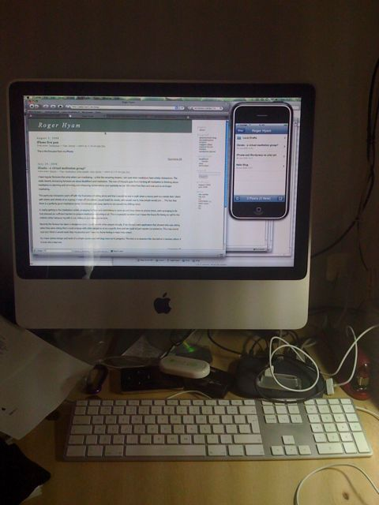

This is the first post from my iPhone using the iphone app - but then edited on my desktop - I am not that fast at typing on an iPhone yet!

I found that the problem I was having with connecting the iPhone was not with the iPhone Wordpress app (v1.0) but with my WordPress (v2.6) install. The call to the xmlrpc rsd function was timing out. It was taking > 1 minute and so the iPhone would just die waiting. When I called it from a regular browser it would eventually load and display the list of APIs supported by the WordPress XMLRPC client.

I am not paid to do this kind of thing and just wanted it working so I was not about to launch into learning about the whole WP blog software and WP iPhone app. I had already spent an hour with the iPhone app in the XCode debugger to get this far. I simply commented out all the APIs that I wasn't interested in getting to function and hey presto it works. I also created an uploads folder with the correct permissions so I can send photos.

Here is a step by step of what I did:

- This assumes your own WordPress 2.6 install (you are not using WordPress.com) - it may work with other verions. You are having problems getting your iPhone WordPress app to connect to your blog at all. The app just runs and runs and dies.
- Call the XMLRPC rsd function on you blog. To do this just go to /xmlrpc.php?rsd. If it takes a long time to come back (over 30 seconds) this may be your problem. Here is an example from a blog on WordPress.com:
    - [http://missionmission.wordpress.com/xmlrpc.php?rsd](http://missionmission.wordpress.com/xmlrpc.php?rsd)
- Calling this on my blog would take two minutes before I removed the other APIs from the call. Call my blog and see the result.
    - [http://www.hyam.net/blog/xmlrpc.php?rsd](http://www.hyam.net/blog/xmlrpc.php?rsd)
- To do this I just commented out a series of lines in the xmlrpc.php file. If you look at this file in a text editor you should be able to work out what to do even if you have a miniscule amount of PHP knowledge. You could delete them if you kept a backup.

While you are looking at the files in the WP install you could create an 'uploads' directory in your wp-content directory and set the permissions so the webserver can write to it. This will allow you to upload photos as well.

Obviously if you use any of those XML-RPC APIs to update your blog it will break those APIs. It shouldn't break the data feeds of those name though. See my atom feed still works:

[http://www.hyam.net/blog/wp-atom.php](http://www.hyam.net/blog/wp-atom.php)

Warning: this is just friendly chat. I take no responsibility for any actions you take. Your blogs are in your hands.

