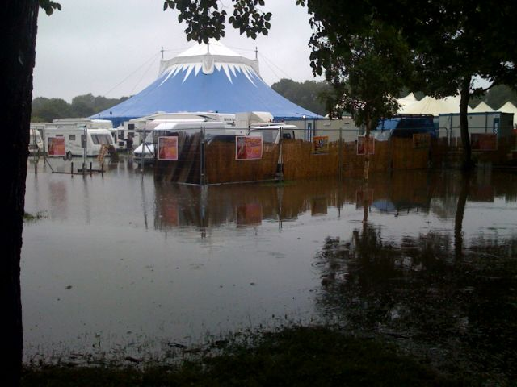

The meadows is being abused through over use for corporate events. I walked through the rain this morning passed two circus big tops (Lady Boys of Bangkok and Chinese State Circus) plus a fairground  joined on to them with a series of big rides. They are erecting corporate type marques at two other places. There have already been a series of events on the meadows this year and they are beginning to suffer. Why can't they leave our green spaces in piece?

