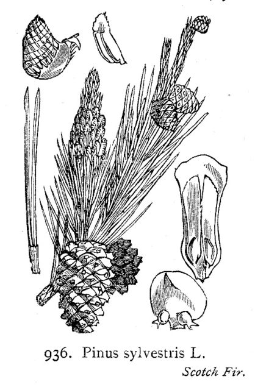

I started to get a bitter taste in my mouth after eating. At first I thought I was going to die so I Googled on it - how many people a minute go through that process! My scatter gun approach to diagnosis came up with a series of suggestions. I either had jaundice or I was diabetic or I had eaten pine nuts (possibly from China) in the last few days. My skin isn't yellow and my pee isn't orange and I am not thirsty all the time but I had eaten a new kind of pine nut in the last few days so the third option looks like it warrants attention. After Googling start blogging.

There is a very short scientific-like paper out there [Taste disturbances after pine nut ingestion](http://www.euro-emergencymed.com/pt/re/ejem/fulltext.00063110-200103000-00036.htm). In the initial case the pine nuts were oxidized and not fit for consumption but six other cases are mentioned and it is not clear if these were oxidized. A test subject also consumed two portions of nuts which I guess they wouldn't do if they were oxidized. Importantly there was no fungal contamination, no pesticide contamination and they didn't know what species of tree the nuts were from but they had come from China.

The [wikipedia pine nut page](http://en.wikipedia.org/wiki/Pine_nut#Risks_of_eating_pine_nuts) currently summarises and has a few links to discussion groups where the effect is mentioned.

Now I eat pine nuts a lot (I am a veggie) and this is the first time this has happened. It is also the first time I have had 'Baby' pine nuts which were sold as being small. My theory is that these are actually a different species of pine nut. This would be fun to investigate.

What candidates do we have among commonly eaten pine nut species ( according to Wikipedia)

_**Pinus gerardiana**_, known as the **Chilgoza Pine**, 'noosa', or 'neoza', is a [pine](http://en.wikipedia.org/wiki/Pine "Pine") native to the northwestern [Himalaya](http://en.wikipedia.org/wiki/Himalaya "Himalaya") in eastern [Afghanistan](http://en.wikipedia.org/wiki/Afghanistan "Afghanistan"), [Pakistan](http://en.wikipedia.org/wiki/Pakistan "Pakistan"), and northwest [India](http://en.wikipedia.org/wiki/India "India"), growing at elevations between 1800-3350 m. It often occurs in association with [Blue Pine](http://en.wikipedia.org/wiki/Blue_Pine "Blue Pine") (_Pinus wallichiana_) and [Deodar Cedar](http://en.wikipedia.org/wiki/Deodar_Cedar "Deodar Cedar") (_Cedrus deodara_).(Wikipedia) - This is a possible one. Are its seeds smaller than _P. koraiensis_ I wonder?

_**Pinus koraiensis**_ is Korean Pine. It is native to eastern [Asia](http://en.wikipedia.org/wiki/Asia "Asia"), [Manchuria](http://en.wikipedia.org/wiki/Manchuria "Manchuria"), far eastern [Russia](http://en.wikipedia.org/wiki/Russia "Russia"), [Korea](http://en.wikipedia.org/wiki/Korea "Korea") and central [Japan](http://en.wikipedia.org/wiki/Japan "Japan"). Korean Pine differs from the closely related [Siberian Pine](http://en.wikipedia.org/wiki/Siberian_Pine "Siberian Pine") in having larger cones with reflexed scale tips, and longer needles. The seeds are extensively harvested and sold as [pine nuts](http://en.wikipedia.org/wiki/Pine_nut "Pine nut"), particularly in northeastern China; it is the most widely traded pine nut in international commerce. - Very likely. (Wikipedia)

_**Pinus pinea**_ Stone Pine (or Umbrella Pine) Native of [Southern Europe](http://en.wikipedia.org/wiki/Southern_Europe "Southern Europe") in the [Mediterranean region](http://en.wikipedia.org/wiki/Mediterranean_region "Mediterranean region") (Wikipedia) - not likely contender.

_**Pinus edulis**_ Colorado Pinyon or Two-needle Pinyo is native to the United States and so not likely contender.

_**Pinus cembroides**_ Mexican Pinyon - mexican so not likely to bother us.

_**Pinus monophylla**_ Single-leaf Pinyon - USA native so not likely to bother us.

Looks like there are two contenders. Common things happen commonly so I have probably been eating P. koraiensis for years as it is the most commonly traded. Perhaps these new seeds are _P. gerardiana?_

I will investigate further.

You may also be related in a [related blog post](http://www.hyam.net/blog/archives/73).

Comments are now closed on this post. You can read and explanation [here](http://www.hyam.net/blog/archives/839).
