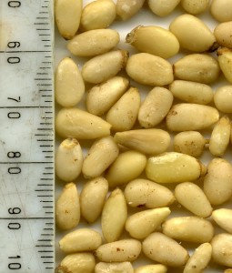
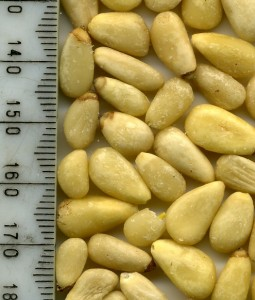

The bitter taste in my mouth continues so my investigation goes on. The suspect 'baby pine nuts' came from [Julian Graves](http://www.juliangraves.com/) store in Livingston a couple of weeks ago. I remember they had both regular and small pine nuts and we bought the small but as I quickly discarded the packaging I don't have any information about them beyond my memory.

So off to the Edinburgh Julian Graves to see if I could find some more but this is a small store and only had the regular pine nuts. I bought them for comparative purposes. Here are the pictures of the two types of nuts.

\[caption id="attachment\_74" align="alignleft" width="255" caption="Baby Pine Nuts from Julian Graves Livingston"\]\[/caption\]

\[caption id="attachment\_75" align="alignleft" width="255" caption="Regular pine nuts from Julian Graves Edinburgh"\]\[/caption\]

The smaller ones appear to be more oily - they stuck to the scanner lid when the others didn't. Perhaps they are just lower grade and off?

The new packet I have does not state the country of origin which we need if we are going to track down the species. I did think this had to be listed for legal reasons in the UK.

Next step write to Julian Graves and ask them.

Comments are now closed on this post. You can read and explanation [here](http://www.hyam.net/blog/archives/839).
