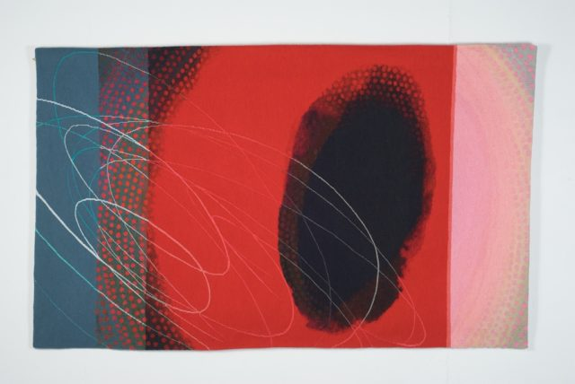

\[caption id="attachment\_449" align="aligncenter" width="576" caption="Tapestry by Jo Barker"\]\[/caption\]

I spent a fun evening recently helping Jo Barker photograph her tapestries for an upcoming catalogue and exhibition. Her work is amazing. This one is my favourite of the session. Jo's exhibition is at the [Scottish Gallery](http://www.scottish-gallery.co.uk/ "Scottish Gallery") and opens on 7th January.
