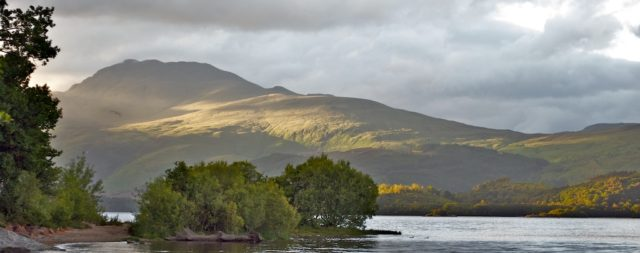

\[caption id="attachment\_444" align="aligncenter" width="576" caption="Loch Lomond"\]\[/caption\]

Joscelyn (8 years old) came home with an assignment to write a poem about Scotland because it was near St Andrew's day. The instructions on what was required were a bit confusing. She has a piece of paper with SCOTLAND written vertically down the edge so each line began with a letter. She had to write something Scottish on each line with a describing word. It is difficult to do it "properly" but fun if you relax the rules. Here is what dad came up with while cooking tea. We are debating whether to send it to school as Joscelyn's work.

**S**erious surfs **C**razy Ceilidhs **O**verly audacious **T**artan Traversed **L**ochs and Lavies **A**tlantic Antlers reach **N**early to the North Sea **D**undee; Cake of Kings

Surely a poem almost as worthy as those by the great [William Topaz McGonagall](http://www.poetryofscotland.co.uk/Mcgonagall/mcgonagallhome.php).
