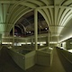

Back in April when I knew the RMS was going to close for three years for renovation I decided to do some panoramas to capture its pre-renovation state. As with many projects it reached a set level then sat on my hard drive without being launched. A chance conversation reminded me of it so I have put it on the web. Take a look at [Royal Museum of Scotland - as it was in April '08](http://www.hyam.net/rms-vr/) . You may find it looks better in Firefox than IE. I haven't had a chance to mess with a Windows machine and work around the inevitable IE bugs.

The site uses the open source Java panoview rather than the commercial Pure viewer I have been playing with recently. Both approaches to publishing pans are rather clunky and inadequate I think.
