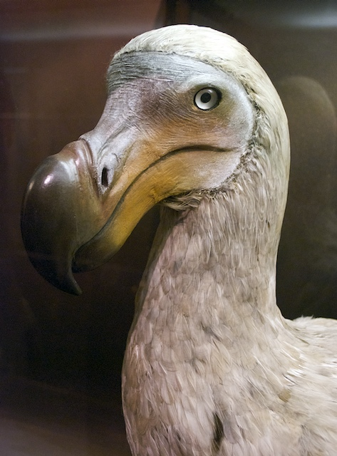

\[caption id="attachment\_411" align="alignleft" width="284" caption="Dodo"\]\[/caption\]

With apologies to René Magritte.

Imagine you are a judge in a small court and I am the accused. I have been caught stealing coconuts from the local supermarket. In my defense I say I did it to feed the last remaining flock of dodos that I have living in my garden. Thus I am committing a small crime to prevent a greater disaster - which is an adequate defense provided they really are dodos.

How do we establish whether the things in my garden are dodos or not?

Being broad minded you visit my garden and look at the birds. They appear, to you, to be turkeys. So it is your word against mine. I say they are dodos because I have a broad definition of what I mean by 'dodo'. You, and probably any expert you ask, think I am mad. But still we are talking of a matter of opinion. I use the word dodo differently to other people. In fact every scientist you ask will come up with a different  diagnosis of a dodo - unless they are allowed to collaborate. There is no 'official'  definition of a dodo or any other species. There isn't even a list of definitions of species or a way to recognize a adequate definition of a species over an inadequate definition. So if you ask what a dodo **is** some one will typically make up a definition on the spot. If you are very lucky they will point you to a published description.

What about all those scientific names you say. The scientific (Latin) name for dodo is _Raphus cucullatus_ L (1758). Does this help? There will be a type (or reference) specimen linked to _Raphus cucullatus_ and you could go and touch this specimen but it will consist of a pile of bones or a stuffed skin and is definitely not what we mean when we say "This is a dodo!". Not all _Raphus cucullatus_ are exactly the same as the type specimen. How different can they be and still be _Raphus cucullatus_?

The bottom line is that taxonomy may go the way of the dodo without rapid change. The key thing that is needed is a list of species definitions. What we call the species is secondary to having the definitions for those species. The name is an attribute of the taxon yet many people seem to treat taxa as attributes of names. I suspect I have been guilty of this...
