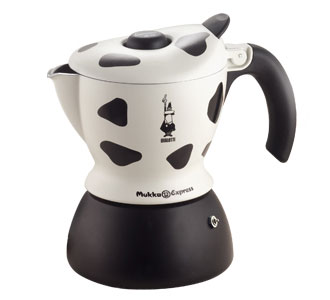

My [Mukka coffee maker](http://http://www.bialetti.it/uk/catalogue/scheda.asp?id_cat=69) just arrived. It is great!

It is like a regular stove top espresso maker but you put milk in the top and it has a clever-valve-thing that froths the milk as it makes the espresso thus creating a  cappuccino. Bit tricky to get used to at first and not for the faint hearted. It sits there hissing on the flame then makes a clear 'pop' before the authentic throat hacking cappuccino sound as it does the frothing.

Does great with soya milk too.

I am working at home today so I can use it some more.

There is even a film [here](http://www.prezzybox.com/products/index.aspx?pid=3553).

\[Hint: take the valve off before separating the two halfs as it creates a vacuum when it cools\]
