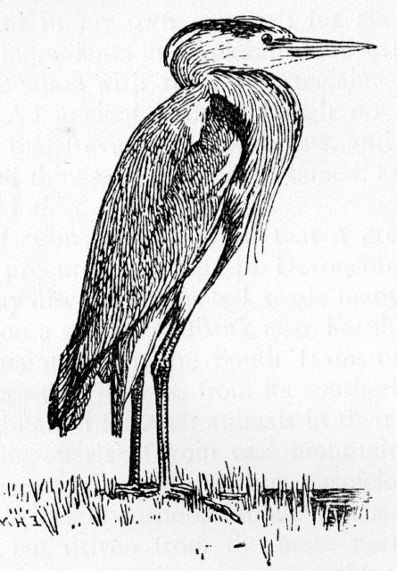

The nice thing about blogging is that you get to mix-n-match your thoughts together in a way that you couldn't do in the constituant parts of your life. This post brings together the notion of Globally Unique Identifiers (GUIDs) from my world of work and Buddhist notions of identity. It isn't really acceptable to talk Buddhist spirituality in biodiversity informatics meetings and bringing up techie stuff when talking to Buddhist friends doesn't help communication much either but here I can bravely attempt to mash the two together and I hope  shed light on both.

Buddhism is widely and erroneously believed to propose the notion of _anatman_ meaning 'no soul'. _Atman_ figures big in Hinduism and in Abrahamic faiths as 'soul'. Buddhism has a different spin on the soul and this is where the error often comes in. Generally different-from-having-something is considered to be not having it. Therefore it is concluded that there are no souls in Buddhism - but this is confused thinking.

"Do you have a soul?" is a [loaded question](http://en.wikipedia.org/wiki/Loaded_question). It assumes firstly that the world can be split into things, secondly that these things can have possessive type relationships and thirdly there are two things 'you' and 'soul' that may have this relationship. If you have a problem with any of these assumptions it is difficult to say anything in response to the question. Any notion of a self or even a thing is totally contingent on everything else in space time. Buddhism finds it difficult to locate 'you' and 'soul' and so impossible to express an opinion on their relationship.

This is exactly where we arrive at biodiversity informatics and the problems we have with GUIDs.

<!--more-->

A GUID is a value (string of symbols) that is used to identify or name something. An [ISBN](http://en.wikipedia.org/wiki/Isbn) is an example of a GUID. GUIDs are very useful. One of the most widely know types of GUID are the [URLs](http://en.wikipedia.org/wiki/URL) used to address webpages. The thing that makes GUIDs particularly useful is being able to 'resolve' them (sometimes called dereferencing). We can resolve a URL into a webpage like the one you are reading or we can enter an ISBN in a library catalogue and get back a description of a publication. But here we hit a problem. When we resolve a URL to a webpage we actually get that webpage. When we resolve a ISBN we don't get the book. Instead we get information about the book (metadata) that we can use to gain access to a copy of that book. The ISBN doesn't represent 'a' book it represents a class of books that a publisher has tagged with this identifier. The case isn't even clear with the URL. We may get different content to the webpage depending on who we are or where we are. To use a biological example does the GUID represent a catalogue entry for a specimen in a herbarium or the specimen itself.

"What does the GUID actually represent?" Is a very similar question to "Do you have a soul?" They are both wrapped up in notions of identity that we tend to fudge over in everyday life.

To say I don't exist is blatantly stupid. Here I am typing this blog. To say I am undefinable is not so stupid. Clearly I came into existence and will cease to exist in the sense that I was born but during what I hope is a very long life every atom in my body will change totally. Only by convention do we give the same name and identity to the stream of events associated with my physical body and mental constructs. This applies to all objects and phenomena. They are all ephemeral and contingent in that they arise in dependence on current conditions and disperse again when those conditions no longer exist. None of this stops us thinking about and manipulating the world in terms of solid existing objects with identities. I still have an identity and I still have to pay tax but this identity is a useful construct between me and the state it is not an absolute philosophically defineable thing.

A parallel occurs in biodiversity informatics. We create GUIDs for objects but what those GUIDs identify is fluid. Only a loose convention dictates what they represent. Here is a clear example. A specimen in a museum has a label with a name, longitude, latitude and bar code on it. The information for that label is added to a database. The barcode is used to identify the record in the database and as the basis for a GUID. The information in the database is published to [GBIF](http://www.gbif.org/) and GBIF plot the data on a map of distributions for that taxon. The dot on the map is labelled with the GUID. We could argue till the cows come home (and frequently do) about what in this chain of events the GUID applies to (is it an occurrence record, a specimen, specimen label, a determination of a specimen, a database record, a dot on a map etc) but we will never find an answer just as we will never square the circle as to whether we have a soul. We are simply asking the wrong question.

The way we should approach these things is not to separate the notion of identifier and identity. The act of publishing an identifier is like erecting an identity. It is saying "We assert that a thing exists and we are going to make a set of assertions about this thing." Before the GUID is published "no thing" exists! Before we give it a name it isn't separate from the flux of contingent events around us.

As soon as we make this leap and acknowledge that we are creating a model of the world which involves fabricating the existence of things for our convenience everything becomes a lot easier.

The fun part is that this applies as well to biodiversity informatics as it does to life in general.
