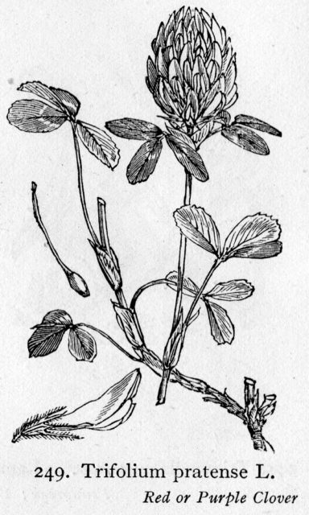

I recently took part in a very long discussion on LSIDs on the TDWG-TAG mailing list. This seems to have been a perpetual discussion over the past four years. On reflection I realised that over two posts I had produced a kind of personal position paper on LSIDs and that it would be worth capturing the text in a blog post so it didn't disappear into the mailing list archives. People often ask about LSIDs and it would be useful to have somewhere to point them to. Note that this text is off a technical discussion list and not newbie friendly. It assumes you know about LSIDs as a technology.

One issue that repeatedly comes up with LSIDs is that they may be more permanent than URIs. They offer a sociological advantage in that they are separate from ephemeral HTTP URLs that are used for everything on the web. The act of minting an LSID indicates that you intend to try to make it permanent or at least never re-use it for another resource.

The barrier to everyone hosting LSIDs is that they don't all have access to DNS servers and can't host the relevant SRV records. There are other barriers to do with binding LSIDs to particular institutional domains that may change. A solution to this may be to have a central service that hosts DNS records and it is implied that this would help with persistence but just hosting SRV records or supplying a redirect service does not actually provide any persistence at all to the data/metadata. Persistence of a GUID to 500 error rather than a not found is not helpful.

<!--more-->

I have said in the past "If persistence is important to you then keep your own copy." This is how it has worked for 100s of years in the library community. If the reason for having a centralised resolution mechanism is to try and support persistence then the centralised service should actually cache metadata (not data). I would imagine a scalable infrastructure would be quite simple to implement. Data could be stored in a Lucene index or Hadoop cluster or something. It would only be a very large hash table and only keep the latest version of the RDF.

Without some kind of persistence mechanism the only advantage of LSIDs is that they **look** like they are supposed to be persistent. Unfortunately, because many people are using UUIDs as their object identifiers LSIDs actually look like something you wouldn't want to look at let alone expose to a user! CoL actually hide them because they look like this:

urn:lsid:catalogueoflife.org:taxon:d755ba3e-29c1-102b-9a4a-00304854f820:ac2009

No normal person is going to read this or type it in. I am afraid that when people started using UUIDs in LSIDs it blew the sociological argument for LSIDs out of the water for me. I had carefully designed BCI identifiers to be human readable and writable like this:

urn:lsid:biocol.org:col:15670

Which would work as a foot note in a paper but the only way a UUID can work in that context is if it is hyperlinked and to be hyperlinked it will have to be an HTTP URL underneath which begs the question of why we are displaying a non human readable string as the human readable part of a hyperlink! So we hide the LSID completely and have no sociological advantage.

I understand why people used UUIDs. There are good technical reasons especially in distributed systems.

If LSIDs are a brand then they need a "unique selling proposition" and that implies something behind them beyond what can be had for free from other brands. You must use LSIDs because.... "We recommend them" is not an adequate answer.

Another point that worries me is that all discussion of LSIDs is about how to publish them not how to consume them. LSIDs are better than HTTP URIs for the client because... (I still can't answer this question)

Currently the reason for me tagging my data with GUIDs has to be because it enables users to access and exploit my data in cost effective ways they couldn't before whilst crediting me with producing it so that I can attract funding to my organisation to curate and collect more data.

The reason for clients using GUIDs is that it enables them to mix and match data in ways they couldn't before so as to produce more, higher quality scientific publications and so attract funding and kudo.

These are the selling points for GUIDs. How well do LSIDs enable them?

If LSIDs are to succeed for the biodiversity community they need a service with long term support from large organisations and projects.

DOIs have a business model. LSIDs currently do not. Without a business model (read funding) we should stick to something that doesn't have the implementation/adoption impediment of LSIDs and make the best of it (i.e. just have a usage policy for HTTP URIs).

The up coming e-Biosphere conference (June) is billed as an opportunity for the heads of the bigger projects to get together and decide what will happen for the next 10 years. If we are going to be using LSIDs in the future those heads need to agree to fund a DOI-like infrastructure for LSIDs or come out and say they are not prepared to do it.

TDWG can act as a forum for these projects/organisations to coordinate their actions but doesn't have its own resources.

I believe this is largely a political problem not a technical one. It needs to be resolved quickly.

If it is decided to develop a central service we have to have a service that adds **real value** (of an order of magnitude that crossref adds to DOIs) to LSID usage. Without this we are better off sticking with today's standard web technologies.

To use a fine English idiom "you cut your cloth to suit your purse". Currently we don't have a shared purse so arguments about how to cut our cloth will never be resolved. X is undefined and I am not sure Y is that well defined. This is "chicken and egg" in that we need to come up with requirements to request a purse  but we really need to have some indication (from a political point of view) that some one will be willing to commit long term resources to the common good before we can present a menu of choices for what money could be spent on.

1.0 developers/year (in perpetuity) gets us a server or two managed to support some kind of DNS based SRV hosting or redirect services or Handle system with support for some library development and help desk stuff.  (Note I am not talking servers or meetings or reports or technology and I am talking commitment to pay people to have it as their responsibility to maintain the system both socially and technically - for the long term!!!).

Without the indication that some one (a consortium perhaps) is likely to formally commit to a minimum of this level of resources we are wasting our time talking about resolution mechanisms that are not DNS based i.e. 'just' variations on the PURL model.

Even if we (as the technical community) have an offer of funding we have to be very careful that it is the best way forward. Will it actually provide something useful or will it just add another level of complexity with few if any benefits?

If we **do not** have the money to build a walled garden we have to graze on the common with everyone else.

If we **do** have the money to build the garden we have to look at the **benefits** of doing so not just waste our time arguing about the **features** of the garden.

### Addendum

A very interesting post came to my attention (courtesy of Rod Page) about CrossRef going down. This is an interesting read when you consider the whole of DNS never goes down - although the odd domain may disappear for a brief while. After reading [this post](http://bibwild.wordpress.com/2009/04/20/the-dangers-of-the-free-cloud-the-case-of-crossref/) you may be of the opinion that using a central resolver is probably a bad idea and I would tend to agree with you.
