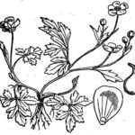

Most people are familiar with a few [Zen kōans](http://en.wikipedia.org/wiki/Koan) - the 'nonsense' sayings of the great Zen masters that are designed to make us think or rather not think. Their aim is to point more directly to what can't be said in words. Examples include: "What is the sound of one hand clapping?" and "Does a dog have Buddha nature?". Sitting silently and bearing a kōan in mind can be a powerful means of expanding our understanding. A kōan that would be useful for those of us involved in the discussions on Globally Unique Identifiers ([GUID](http://en.wikipedia.org/wiki/GUID)s)  at the moment is: **What is it that persists when a GUID is persistent?** I have been dwelling on this for a while now and I'd like to share some of my thoughts.

<!--more-->

I'll use a comparison between a [DOI](http://en.wikipedia.org/wiki/Digital_object_identifier) and a [PURL](http://en.wikipedia.org/wiki/PURL) type GUIDs as examples. I am taking two types of identifier to illustrate that we are talking about generalities. This is not intended as a showdown between the two systems.  The arguments apply as well to other systems.

A DOI looks a bit like this:

doi:10:123/abc

A PURL looks a bit like this:

http://purl.example.org/abc

Both these things are supposed to be persistent identifiers. Before we look at what the specifications say lets think about what could persist in the context of these GUIDs.

Firstly they both consist of a string of characters. We can clearly say that the string of characters is persistent through time - or can we. If at some point in the future these particular strings of characters didn't exist then they wouldn't have proved persistent. They would have gone! Clearly we are unlikely to know that they have gone because we wouldn't know what we had lost. There may be hints that there once was a string of characters that was used for an identifier but we wouldn't know what they were - a little like a missing fragment of the dead sea scrolls. This is all very esoteric. Clearly we will only be interested in these things if at least the character strings are present in the future. Our grandchildren will look at them and want to do something with them.

Next we have the objects that the GUIDs identify. Neither of these GUID systems require the resource or digital object that they identify to be immutable. In fact DOI sell the fact that they do "multiple resolution". The DOI resolves to a list of resources that dynamically changes through time. So how much can it change and still be considered to be the same thing? Who makes this judgment, the owner of the GUID now or their descendants? [LSIDs](http://en.wikipedia.org/wiki/Lsid) are different in that they require their data to be byte identical but they also allow the data to be discarded. The LSID authority is required to return identical data every time or to cease returning the data altogether. This definitely isn't a persistent object in any normal meaning of the word. There is therefore no persistence to be found in the object beyond that abstract notion that something is identified (see also [Identifiers, Identity and Me](../archives/304)).

What about the mechanism to get from the the GUID to the resource it identifies? How is the GUID actionable or resolvable over time? The PURL uses the current [DNS](http://en.wikipedia.org/wiki/Domain_Name_System) system and the [Hypertext Transfer Protocol](http://en.wikipedia.org/wiki/HTTP) (HTTP). This resolution mechanism may go on forever or it may change or go away. If you resolve a DOI today the chances are you will use the same system via the DOI proxy service [http://dx.doi.org](http://dx.doi.org) but there is another official resolution mechanism using the [Handle System](http://www.handle.net/). The [IDF](http://www.doi.org/) who run the DOI system work on the basis that the DNS system will one day go away which is why an alternative resolution system is needed. Even the use of the Handle System is deemed as temporary. This may change in time or be replaced as the official resolution mechanism.  So there is no persistence in the resolution mechanisms. An application that uses what is available today will stop working tomorrow because resolution mechanism changes.

What do we mean by resolution failing? I may have a DOI today that resolves to a resource that I use. Tomorrow that resource may belong to someone else who refuses me access to it. The resolution of the DOI still works. It is persistent but just gets me to a forbidden. The same could happen with a PURL. I could get an HTTP status code of 403 (Forbidden) or even 410 (Gone). The identifier is persistent, the resolution mechanism is persistent and the object is persistent but for some reason we can't have it.

The resolution could just fail with a time out. Now we don't know what has gone wrong but if the DNS name can't be found and has no owner and the IDF are no longer picking up the phone we may assume the worst and that there is no official resolution mechanism remaining. What we do today would be to Google for the identifier instead. Chances are we would find the object in question and search engines are likely to get better rather than worse. We now have an unofficial resolution mechanism. Does this count as permanently resolvable? If multiple third parties maintain hashtables of identifiers and cached metadata (or even data) does that count as adding a persistence layer?

What have we got so far beyond a load of questions? We have a string that identifies something that may or may not exist or change. We may or may not be able to resolve (take action) on the string in order to find the object via official or non-official means. So where is the persistence? Why do people use that word?

The [DOI Handbook](http://doi.org/hb.html) has some clarification on what is meant by persistents for DOIs _"Persistence is the consistent availability over time of useful information about a specified  entity: ultimately guaranteed by social infrastructure (through policy) and assisted by technology such as managed metadata and indirection through resolution which allows reference to a first class entity to be maintained in the face of legitimate, desirable, and unavoidable changes in associated data such as organisation names, domain names, URLs, etc.__"_ (6.7.1)

Ah ha! So persistence is about social infrastructure not about technology and if the social infrastructure does its job correctly we may access "_useful information_" not necessarily the object the GUID identified yesterday.

Let us take a look at the social infrastructure parts of the GUIDs. Here I parse out the strings into individual parts.

| DOI | PURL | Notes |
| --- | --- | --- |
| doi: | http://purl. | Both identifiers start with a declaration of what they are and therefore give the client application an idea of how they can be resolved. The client needn't know that the PURL is intended to be permanent and can treat it like any other HTTP URI. Who knows many other non-PURL HTTP URIs may hang around a bit. The doi: indicates that there is a specific service behind the identifier. Clients need to understand both doi: and http: to resolve both these. The resolution mechanism of doi: is by social contract involving IDF - currently a client needs to know that IDF use Handle. The resolution mechanism of http: is by social contract with the whole internet community. |
| 10. | .org | Currently DOI uses the Handle System so the 10. indicates this is a DOI and not another Handle. This is immutable. If you argue with IDF and don't want them to resolve your ids anymore you are stuck. They all start with 10. Likewise .org is owned by the great internet Gods (ultimately this is governmental). If you argue with them and aren't allowed to have a subdomain of .org anymore then you are stuck. Who are you more likely to fall out with? What are the arbitration mechanisms etc etc. |
| 123 | example | In the DOI this is the registrant - the entity responsible for the bit after the slash. In the PURL this is the subdomain. Under DNS this is the mechanism for assigning authority for what comes after the slash. Other than the fact that the registrant isn't used in the resolution mechanism by the client and the subdomain is the two are very similar. DOI's have object level ownership of GUIDs once they are minted and PURLs don't though a mechanism could be put in place should this feature actually be required. If there is an internal argument within the entity responsible for this part of the GUID then we are in a mess with both identifier systems. Under DOI the IDF could split individual objects between owners (if agreement could be reached on who owned which) in PURL the people in dispute would have to get a third part to do the redirection for them. Either way we are talking lawyers and it is likely to be a rare event especially if these subdomain/registrant identifers are kept quite granular as recommended by all concerned. |
| abc | abc | The object identifier is the responsibility of the registrant or current owner of the GUID. It is the part of the social contract that no one seems to care about. In both cases it is up to the registrant to make sure that there is something really useful that the GUID can ultimately resolve to. IDF will ensure that something 'useful' is returned but this might just be a note saying it has gone. |

Where is the persistence in the social part of the GUIDs? The DOI Handbook states this very well. It comes down to persistence of the social structures. Who do you trust to maintain a system? So when we are talking about persistence are we really talking about trust?

What I find most interesting is that the only people who promise persistence are people who are trying to persuade you to use their system. The basic message is "don't trust them trust us". "You can trust us because we will always work". In the case of DOIs IDF can only make that promise because they careful define what "work" means. They will return to you (as a client) "useful information" not the resource you want. IDF don't own that resource and have no control over your access to it or the reliability of its hosting. PURLs are a little more amorphous but the message is similar. This service will always redirect you to the right place but unless the service owns the "the right place" the PURL can do nothing to assure you of what you might find.

It is kind of like the guy selling seagulls on the beach. You give him £5 and he points into the sky and says "That one is yours". Yes he is providing a service but the relationship that counts is the one between you and the gull.

This is **not** an attack on DOIs. It **is** an attack on all notions of persistent GUIDs.

What we really want is a GUID that works **now, today, this moment, when I need it to work**. When we say GUID persistence what we really mean is reliability of GUID resolution in the short term. This is something entirely different from persistence for the long term! If it doesn't work now we will never build a system that is worth preserving into the future. Lets just do the easy stuff now and then migrate it if we ever need to. I believe this is my final word on persistence of GUIDs

Most importantly of all, how have we benefited spiritually from this kōan study? There are two things that are apparent. One is that all is change. All is in flux. The other is that there is only really now. Unless we are alive now we are likely to miss reality entirely and spend our lives living in conjecture - talking about GUID technology instead of building something that works with HTTP URIs!
