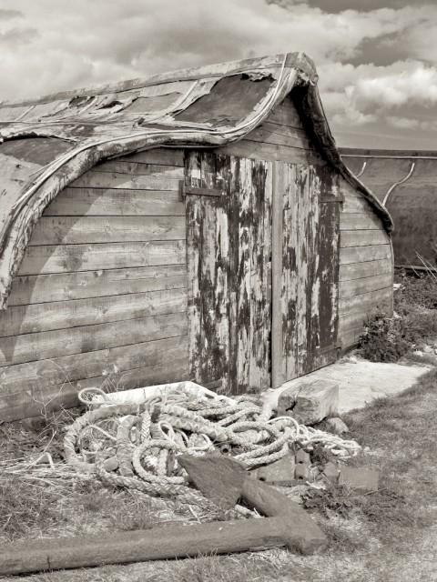
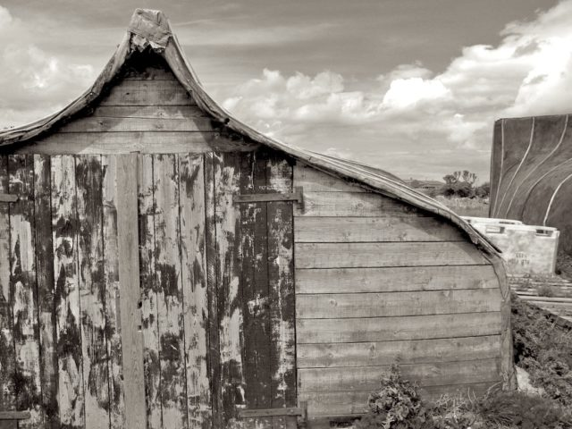
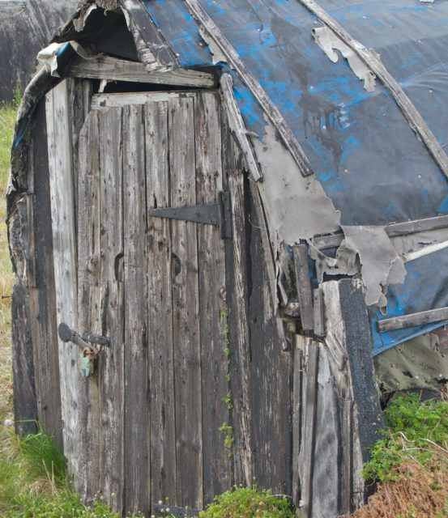

Last weekend we got away from the city for the first time this year to camp in Northumberland and visited [The Holy Island of Lindisfarne](http://www.lindisfarne.org.uk/). This is a tourist mecca of an island accessible via a causeway that is only open at low tide. Think of many retired people with ice creams and you will get the picture. It is a lovely place though.

<!--more-->One day I will write something of my feelings for the fishing industry in the North Sea and how it is symptomatic of our whole inability to act over the environment.

\[caption id="attachment\_455" align="aligncenter" width="576" caption="Former Herring Boat on Holy Island"\]\[/caption\]

But as usual I have little time so here are my photos of how rustic and wonderful the whole thing was - which is pretty much how the tourist industry paints it. None of the interpretative material you find in these places talks about what an environmental disaster it was and continues to be. So lets just celebrate how easy and what fun digital photography really is!

\[caption id="attachment\_461" align="aligncenter" width="498" caption="Yet another former Herring Boat on Holy Island"\]\[/caption\]
