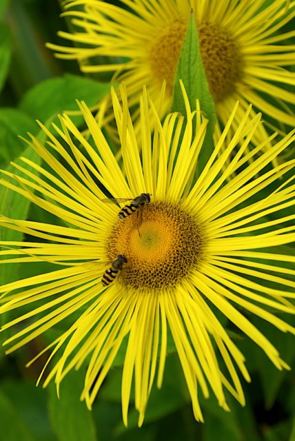

\[caption id="attachment\_476" align="alignleft" width="154" caption="Inula hookeri"\]\[/caption\]

Until December 2010 I am employed as the project officer for Work Package 4 of the PESI project. My particular responsibility is the adoption of standards that will facilitate the integration of European, biological taxonomic data. The first deliverable of WP4 is a report on the current state of biodiversity standards and how they apply to PESI. This is very much a scoping document to outline what we need to do. In collaboration with my colleagues in WP4 and the wider project I have now submitted a final version of this document. It is for public consumption and you can read it here: [wp41\_pesi\_standards\_report\_1\_final\_version](http://www.hyam.net/blog/wp-content/uploads/2009/05/wp41_pesi_standards_report_1_final_version.pdf).

(OK so _Inula hookeri_ is not a European native but it is a naturalised alien in the UK and occurs in [Euro+Med PlantBase](http://ww2.bgbm.org/EuroPlusMed/PTaxonDetail.asp?NameCache=Inula%20hookeri&PTRefFk=7000000) and the picture fell to hand. The flies are probably two male _Syrphus_ - perhaps _S. ribesii_, _S. torvus_, or _S. vitripennnis -_ Thanks to Louis Boumans for the det.)
