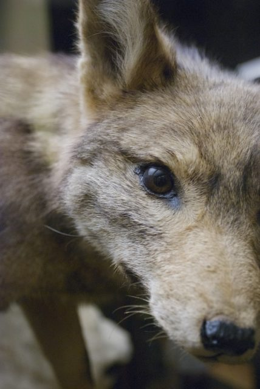

\[caption id="attachment\_532" align="alignleft" width="282" caption="Tring the Fox"\]\[/caption\]

Here is the first draft of a book chapter I have written for an upcoming [Systematics Association](http://www.systass.org/) volume. My intention with this work is to outline the current situation with regard to taxonomy and GUIDs for a slightly more general audience. It includes a walkthough of the difference between nomenclature and taxonomy and an explanation of why nomenclature "sucks" - I don't actually use the 's' word in the chapter.

There are probably still some typos and there may be some factual errors - if so I'd really like to hear about them so I can get them ironed out before the book goes to press.

[Taxa, Taxon Names and Globally Unique Identifiers in Perspective.](perspectives_09.pdf) (PDF ~ 332kb)

Enjoy!

**Back story:** I was asked to contribute to a new [Systematics Association](http://www.systass.org/) volume "_Descriptive Taxonomy: The Foundation of Biodiversity Research_" to be published by [Cambridge University Press](http://www.cambridge.org/) in the autumn. I have written my chapter and it has been accepted but not edited. I am an advocate of open access to scientific publications and it became clear that this publication was not going to be available on the web let alone on an open access basis so I asked CUP if I could publish it through [Nature Precedings](http://precedings.nature.com/) and they said "No" - but they positively encourage authors to publish drafts of their work on their own websites. This is a good compromise as it keeps my moral superiority intact and enables me to move at a reasonable speed but also allows CUP to have a business model producing those things they put in libraries.... what were the called? ah books!

I would advocate that anyone else who is writing contributions to CUP books take advantage of this arrangement and prepublish their material on their own website thus making it as widely and freely available as possible.

**Edit:** I just updated the PDF to include a few comments I have received.  You can still read the [Old Version](perspectives_08.pdf) (PDF ~ 332kb) if you like
