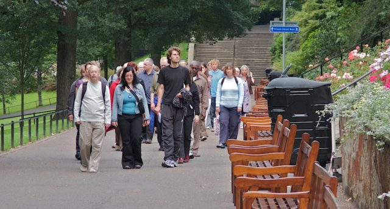

Recently I have been sitting with the [The Community of Interbeing in Edinburgh](http://www.interbeing.org.uk/sanghas/wildgeese/) \- that's [Zen Master Thich Nhat Hanh](http://www.interbeing.org.uk/index.html)'s students to you. The Edinburgh sangha has a wonderful atmosphere. As part of the [Festival of Spirituality and Peace](http://www.festivalofspirituality.org.uk/index.html) the sangha ran a Mindful Peace Walk around Prince's Street Gardens. I arrived a little late and took the above snap before joining the 40+ people for forty five minutes of silent, meditative walking. It is the first time I have done walking meditation in a group like this in a public space and it did feel odd at first. There was a definite sense of self consciousness rather than self awareness but after a few minutes that passed and there was a strong sense of moving through the landscape as something of a positive influence. This was particularly true when we went up onto Lothian Road amongst the regular pedestrians at the end of the walk.I must admit it leaves me wanting more.
