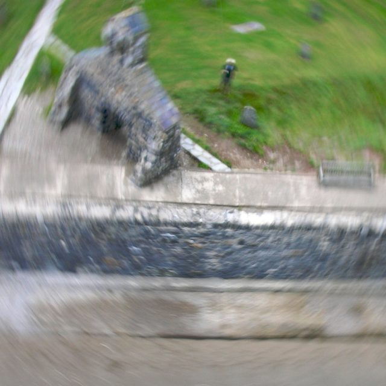
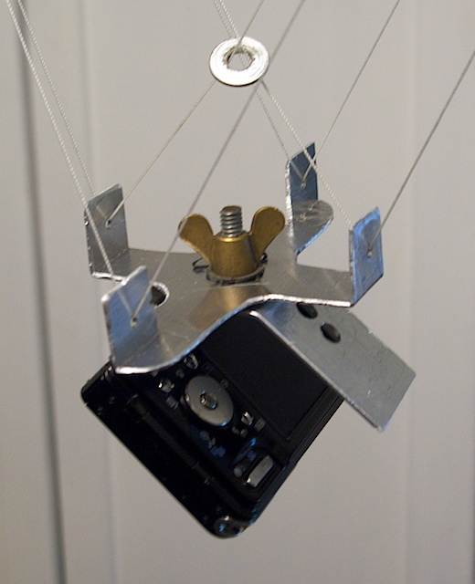
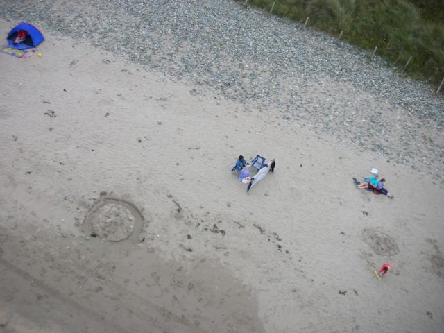

\[caption id="attachment\_552" align="aligncenter" width="478" caption="Cwm yr Eglwys - Wind too strong."\]\[/caption\]

You may not have heard of it but [Kite Aerial Photography](http://en.wikipedia.org/wiki/Kite_aerial_photography) is quite a widespread hobby. It involves strapping a camera to a kite and flying it over something interesting. The camera can be fired remotely or just on a timer. Serious people build complex radio control rigs to move the camera around and point it in different directions.

Doing silly things with cameras appeals to me so, when I realized that my older compact digital camera (a Nikon Coolpix S1) had a feature to fire a shot every 30 seconds, I just had to give it a go. I built a rig using the [Picavet suspension system](http://en.wikipedia.org/wiki/Kite_aerial_photography#Picavet_suspension). Bought a large kite for £30 and took it on holiday to West Wales. The result was terrifying! <!--more-->

\[caption id="attachment\_549" align="alignleft" width="150" caption="Picavet Cross with Nikon S1"\]\[/caption\]

Maybe I am overstating it but it is harder than it looks. Firstly, if the wind is too low the kite won't stay up so you drag your camera along the ground. Then if it is too strong the kite bounces around in the sky and waves the camera about so much the images are blurred. Here are two of my results.

I flew the kite at [Cwm yr Eglwys](http://en.wikipedia.org/wiki/Cwm_yr_Eglwys) which is a sheltered bay but it was quite a windy day. As the kite reached a good height the wind took it and flapped it like a flag - hence the blurred picture. Most importantly it was scary. That is me with my hat on looking scared in the photo. This is a popular place and there were people around so I was trying to control a large kite on the end of a cheese-wire-like line that was going to either decapitate someone or take the weather vane off the ruined church.

\[caption id="attachment\_554" align="aligncenter" width="640" caption="Whitesands Bay - Just enough wind"\]\[/caption\]

On [Whitesands](http://en.wikipedia.org/wiki/Whitesands_Bay_%28Pembrokeshire%29) bay the wind was just about strong enough so I got more stable pictures but the subject wasn't so interesting and I didn't have a long enough line to get the kite higher. This is actually a good shot of a British holiday - people trying to keep warm on the beach.

Analyzing  my results I think I am using the wrong kind of kite. I had a cheap sledge type kite when I should really be going for a more sophisticated parafoil that is specifically designed for stability - but these come in at the best part of £200. Then I could use a camera with image stabilization - another expense. Also my Picavet system wasn't very good as the line didn't run smoothly through it - I could buy little pulleys to put on it. All these things would make the system work much better.

The most important ingredient needed is time. You need to be in the right place at the right time where light AND wind are come together. With a young family and a job this is rarely likely to coincide with the brief periods I get away from chores on holiday. My conclusion on Kite Aerial Photography is therefore: fun to try once.  Maybe I'll come back to it in 20 years when I retire.

The photographic techniques I still haven't tried are object movies and stereo. These are infinitely doable for little money so maybe in the next year or so. There is also holography. I once read about doing this in high school science classes with a visible laser and a bead of mercury - I'll probably have to let that one go.
