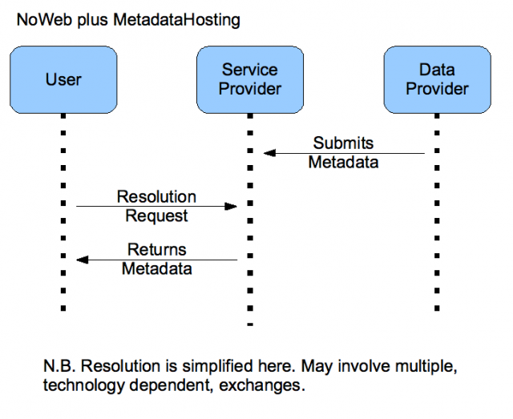
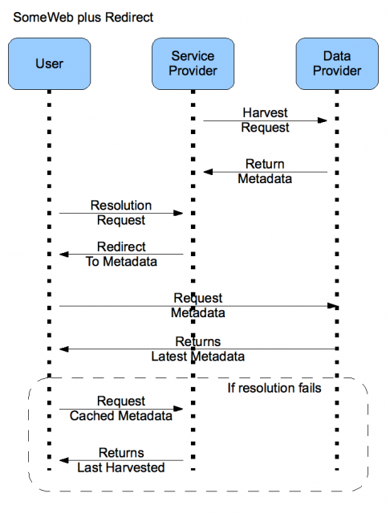
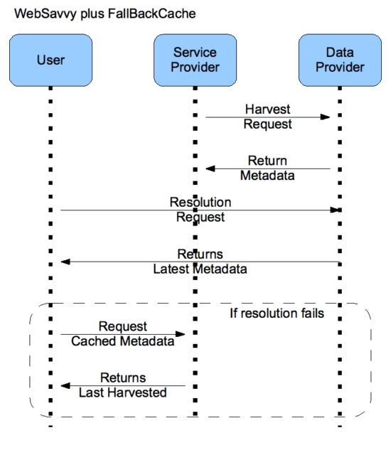
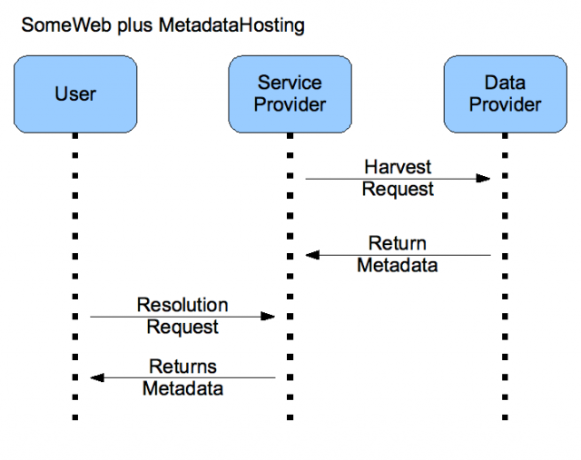

Last week I took part in a meeting at [GBIF](http://www.gbif.org/) in Copenhagen to discuss the role GBIF could play in  Persistent Resolvable Identifiers (the technology formally known as GUIDs and often confused with UUIDs. Perhaps they should be called PRIs - pronounced 'prize' - just kidding.) This is the culmination of the [LGTG](http://www.gbif.org/News/NEWS1243443852) (a.k.a. the Less Than Greater Than group). Thanks are due to Éamonn O Tauma and the team at the GBIF Secretariat for being wonderful hosts and to my fellow participants for being such good company.

This was a two and half day meeting that involved a group of us working on a document full of recommendations (to be published in the next month or so). As part of my contribution I came up with a slightly more detailed plan for how GBIF would interact with data suppliers and consumers. For a brief time this formed part of the final document but was then cut because it was too detailed. It may still make it back into the appendix but may also drop out completely so I thought I would present it here for posterity.

These are more or less just a series of notes and diagrams but they should be understandable to anyone involved in the field. I use the term GUID as this was before we changed to calling them persistent identifiers.

Note that what I present here is what I presented to the group and does not necessarily reflect the views of the group which will officially be published later.

<!--more-->

**Glossary**

1. **User:** An agent that is trying to retrieve metadata associated with a GUID. Think researcher.
2. **Data Provider:** The publisher or owner of the original data. Think museum.
3. **Resolution Service:** An agent supporting resolution of GUIDs published by the data providers and resolved by users. The agent may be distributed with inbuilt redundancy but is  conceptually a single thing. Think GBIF.

**N.B.** These are roles. Different real world entities may play multiple roles.

**Data Provider Types**

1. **NoWeb:** The provider doesn't have a web presence in that they can't (or don't want to) host there data on the web.
2. **SomeWeb:** The provider has the ability to place data on the web but can't guarantee stability of web location i.e. permanent DNS location and/or high availability. e.g. can run a TAPIR provider that is up 80-90% of the time.
3. **WebSavvy:** The provider is  comfortable with hosting their own data and providing their own GUID resolution services including setting up of some DNS records.

**N.B.** All types of data providers need to have an appreciation of GUIDs even if the don't provide resolution services because they need to maintain them in their data internally.

**Resolution Service Types**

1. **Redirection:** GUIDs resolve to the service provider who just redirects the user to the data provider for the metadata. PURLs are an example of redirection but it works just as well with LSIDs where the service provider response to the user with WSDL files but the final location of the metadata (as indicated in the WSDL service file) is with the data provider.
2. **MetadataHosting:** GUID resolution is to the service provider who holds a copy of the metadata previously received from the data provider. No call is made to the data provider during resolution of the GUID so they do not need a reliable web presence.
3. **FallBackCache:** GUID resolution is to the data provider initially but if resolution fails the user can call the service provider as a fall back option. The service provider will then supply a cached copy of the metadata along with metadata metadata saying when they last received  it from the data provider.

**Provider Types by Resolution Service Matrix**

|  | Redirect | MetadataHosting | FallBackCache |
| --- | --- | --- | --- |
| NoWeb | No – Can't redirect to no web presence | Yes – Only option if metadata isn't available from data provider | n/a – if provider can't provider resolution then it won't be available for fall back. |
| SomeWeb | Yes – Service provider give stability to DNS or other part of resolution mechanism | Yes – May be a choice of data provider to not be redirected to. | Yes – if data provider is down for metadata service provider could give cached copy. |
| WebSavvy | No – GUID resolution is to the data provider | No – GUID resolution is to the data provider | Yes – If data provider is down and service provider has cached version |

**Decision Tree For Data Provides**

- No internally unique IDs
    - Go to data management workshop and come back later
- Managed internally unique IDs that can be mapped to externally unique IDs
    - No web presence for hosting data or no desire to set on up and manage it.
        - Submit data to service provider on regular basis. Provider will handle all GUID resolution. **MetadataHosting**
    - Have web presence or willing to set one up and manage it.
        - Web presence but not willing to maintain high availability at a stable domain location.
            - Data harvested by service provider who then provides all GUID services. **MetadataHosting**.
        - Reliable web hosting of data.
            - Not able or willing to commit to long term maintenance of DNS. Unable to alter DNS entry of LSID or perhap create subdomain of corporate domain.
                - Service provider supplies **Redirect** service for GUIDs but also harvests metadata so it can provide a **FallBackCache** if data provider goes down.
            - Able to provide long term maintenance of DNS entries and handle full resolution of GUIDs
                - Service provider still harvests metadata so as to provide **FallBackCache**.

**Sequence Diagrams for Interaction of User, Data Provider and Service Provider**

****
