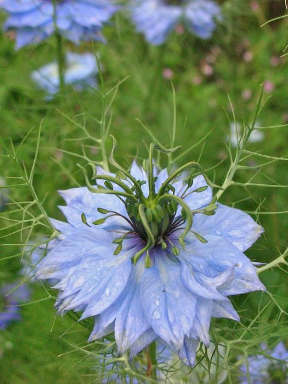

Over the past few months I have been working on how to represent biological taxonomy and nomenclature using Description Logics. Here I combine these thoughts with a rather naive view of DNA Barcoding to suggest a new approach to taxonomy.

[Description Logic](http://en.wikipedia.org/wiki/Description_logics) (DL) is an extension of frame based languages (such as those used in object orientated programming paradigms) and semantic networks (e.g. [WordNet](http://wordnet.princeton.edu/)) to link them to first-order predicate logic thus enabling the representation of application domains in formal, well understood ways that can be reasoned over by machines. DL has come to the fore in recent years with the advent of the [Web Ontology Lanugage](http://www.w3.org/2004/OWL/) (OWL) by the [World Wide Web Consortium](http://www.w3.org/) (W3C). Two subsets of which, OWL-DL and OWL-Lite, are based on DL. Notably these two sub-languages guarantee decidability within finite time. From now on I'll use the terminology of OWL-DL and OWL-Lite rather than generic DL terms. The OWL terms are more likely to be understood by a general reader who can read the OWL documentation as background. A concept in DL is referred to as a class in OWL. A role in DL is a property in OWL.

There are three principal features within OWL:

- **Classes** are groups of **individuals** that belong together typically because they share some **properties** or property values.
- **Individuals** are instances of classes.
- **Properties** are statements of relationships between individuals or from individuals to data values.

There are other features within the language that allow the expression of things such as equivalence, cardinality and the domains and ranges of properties. Using OWL principally involves asserting specialization hierarchies of classes and inferring unknown subclass relationships and class membership using an inference engine such as [Fact++](http://owl.man.ac.uk/factplusplus/). A set of OWL assertions is frequently referred to as an ontology.<!--more-->

DL languages such as OWL appear to be an ideal way to formally present taxonomic monographs - there appears to be a natural mapping between OWL classes and biological taxa; OWL properties and biological characters; OWL individuals and biological specimens. Such a presentation would allow biological taxonomies to be manipulated by machines. It may be possible to allow inference to occur over multiple, potentially overlapping, classification systems. This may facilitate greater efficiency in capturing, disseminating and re-purposing taxonomic data as well as incorporating it into large scale genomic and climatological analyses.

Here I contend, however, that there isn't a natural fit between DL and biological taxonomy and that this is informative of the nature of biological taxonomy as it has been carried out to date. OWL has been conceived as a language to formally describe any application domain with the rigour of knowing that the resultant model can be reasoned over. Biological monographs have evolved as a mechanism for semi-formally describing the domain of living organisms but without the logical rigour of ensuring decidability.

## Class Membership - Why Taxonomists Can Argue.

In OWL individuals can be asserted as being a member of a class using the "rdf:type" predicate. In taxonomy an author will likewise assert that particular specimens are members of a taxon. Indeed, by naming a taxon the author is asserting that at least one specimen, the holotype, must be a member of the taxon under the rules of the ICBN and ICZN. It is also considered good practice for a taxonomist to cite all the specimens examined and assign each to one of the taxa described in the monograph.

The other way to decide class membership is via extension (also know as intention or connotation). In OWL, classes are defined by the restriction and equivalent class constructs. It could be asserted, for example, that a class consists of  "all specimens with four white petals" meaning that any thing that is a specimen and has four petals that are white is a member of this class and any thing that is not a specimen and does not have them both is not a member of the class. Likewise in taxonomy an author provides a description of the taxon in words and specimens that fit the description are deemed to be members of the taxon.

Unfortunately taxonomic descriptions are not as rigorous as OWL class descriptions. It is rarely stated clearly which characteristics, if any, are mandatory for a specimen to be a member of a taxon. Typically the user of a monograph will interpret the meaning of the description in combination with an examination of the cited specimens or illustrations of them and, most importantly, in the light of their own experience. Even diagnostic keys are used primarily as discovery mechanisms that help the user find a subset of taxa for consideration.

This use of both taxon descriptions and exemplar cited specimens is crucial. It means that the taxonomic monograph can **never** be inferred over by a machine in the same way it can be done by a human. During the process of examining cited specimens the human user builds up their own, personal taxon description that is dependent on their skills and experience. They then use this description to decide which individual specimens are members of the taxon. This is a remarkable process as it allows experts to carry out tasks such as identifying fragmentary materials but it also allows experts to have contradictory opinions.

For a machine to carry out a similar process it would be necessary to extract a new class description from the cited specimens as the human does. If the specimens have been scored for each of the properties in the ontology then the automatically extracted description should be the same as original description and nothing more. Indeed if the specimens didn't already fit the description then the ontology would have been invalid. What the machine can't do is take into account additional properties, that weren't considered in the first place, like the human user can.

If we accept that a machine can't do what a human can do in this process we need to think carefully about what we are trying to do in the field of **biodiversity informatics**. Why should we dedicated resources to databasing of historical taxonomy beyond indexing the text if they will never be machine interpretable? Shouldn't we ascertain that the results of our work are useful before we dedicate the time and effort. If information presented in the literature may only ever be useful when interpreted by humans then it only need be imaged and indexed not databased.

The notion that we can scale taxonomy by increased use of information technology is erroneous, at least in part, if there will always be a bottleneck of overworked taxonomic experts.

If the products of biological taxonomy are to be integrated into large scale analyses, such as those required for climate modeling, then they need to change so that they are logically rigorous descriptions of the world rather than principally literary works. A major re-think of why we do taxonomy the way we do is needed if our outputs are to be useful for future generations.

I have, of course, a solution to propose.

## Invert the Notion of Identity

The principle problem with current taxonomy is the fluid notion of identity. Specimens can be identified to taxa, typically by 'naming them' but there is no normative way of settling any uncertainties or disputes because:

1. **Names are not reliable pointers to taxa.** If a specimen is named but the taxonomic classification used in the naming is not specified then it can't be know which taxon (of the multiple possible taxon concepts for that name) it has been identified to. See [Taxa, Taxon Names and Globally Unique Identifiers in Perspective](http://www.hyam.net/blog/archives/526).
2. **Descriptions require human interpretation.** As described above, the use of exemplar specimens combined with descriptions means that identifications will vary between experts.
3. **Relationships between descriptions are vague.** The same name may be used for several separately defined taxa. The descriptions of these taxa may use the same or different morphological characteristics. Some descriptions will omit characteristics used in other descriptions that are ostensibly about of the same taxon. It is therefore not possible to say whether the two description overlap, are equivalents or do not intersect at all.

To overcome these issues two things are required:

1. **Unambiguous identifiers.** In place of the current system of nomenclature (where names point to multiple taxa) we need a system that "hard links" a name (identifier) to the circumscription of a taxon. The resulting identifier can only ever mean one thing.
2. **Normative, Unambiguous Circumscriptions of Taxa.** A method of circumscribing taxa that does not require interpretation by a human and is not subject to context.

We are at a turning point in the study of biodiversity where DNA barcoding initiatives have the ability to deliver a single tool that meets both these requirements - but it does need a shift in thinking before this leap can be made.

Up to now the assumption has been that we are discovering taxa in nature and then attempting to describe them. It is undoubtedly true that taxa do exist in nature. However, in order to construct a usable map of biodiversity, we need to turn this on its head. It is the act of minting an identifier and linking it to a circumscription that creates the taxon. We then discover which specimens in the wild fit into this taxon. Philosophically this his how we act anyway (see [Identifiers, Identity and Me](http://www.hyam.net/blog/archives/304)). Taxa are currently hypotheses (things we invent) that may break down as our knowledge grows.

**An analogy** frequently used in the past is the establishment of a set of pigeon holes for biodiversity that we then post specimens into. These pigeon holes aren't entirely arbitrary (their size and distribution is based on some _a priori_ expectation of what occurs in nature) but they are fixed, inflexible entities and nature isn't guaranteed to fit neatly into them all just as it may not be entirely divisible into species and subspecies.

**My proposal is very simple.** We establish a system where researchers can publish **"Barcode Taxa**". These consist of a registered DNA Barcode that has an associated, immutable human readable name and an  HTTP URI. The system would take the form of a single register, perhaps linked to the existing [BOLD](http://www.barcodinglife.org/) system. Barcode Taxa are conceptually different from existing species for which we have barcodes. With Barcode Taxa the barcode comes first.

The human readable name should be based on an existing scientific binomial or trinomial name followed (in place of the author string and/or year) by the standardized name of the barcode region in square brackets e.g. _Puma concolor_ \[CO1\] or _Rhododendron luteum_ \[rbcL+matK\].

Whilst the human readable string makes it possible to refer to the taxon unambiguously in the literature the HTTP URI would allow machines to reference it unambiguously across the internet.

Any individual specimen that has the barcode for _Rhododendron luteum_ \[rbcL+matK\] is _Rhododendron luteum_ \[rbcL+matK\]. Any individual or specimens that does not have that barcode is not _Rhododendron luteum_ \[rbcL+matK\] - no matter what the morphology involved.

Once the Barcode Taxon is established then **secondary taxonomic products** can be produced. These would take the form of descriptions and keys that are intended to enable people to estimate, from the morphology, whether an individual specimen is a member of a specific Barcode Taxon. Importantly these secondary taxonomic products can be tested for accuracy because there is a normative/standard measure of correctness.

I am not suggesting that all identification is done by barcoding. I am suggesting that the efficacy of diagnostic tools be established so that one can be, for example, 80% certain that one has identified the correct taxon using a particular key. **This can be done independently of taxonomic experts.** An ecologist could establish a field test for insect pupae and barcode a sample of those to establish how accurate the field test is.

In the majority of cases it is presumed that the standard barcoding regions will match roughly with variation of biological significance. If it does not then another barcoding region could be chosen and used as well e.g. _Rhododendron luteum_ \[atpH\]. There is no presumed relationship between _Rhododendron luteum_ \[atpH\] and _Rhododendron luteum_ \[rbcL+matK\]. Any correlation between the two would have to be established experimentally.

**Another analogy** is that of a geodetic datum. [WGS84](http://en.wikipedia.org/wiki/WGS84) is suitable for the vast majority of georeferencing. It is feasible to use other geodetic datums though and there is not, necessarily, a guarantee of being able to convert between all the different combinations. They are essentially separate reference systems. Different barcoding regions would behave in a similar way. They would define different, unrelated namespaces for Barcode Taxa.

Barcode Taxa imply nothing about **phylogeny** although it is assumed that they would be used as putative terminal taxa in phylogenetic analysis and are likely to be monophyletic because of the regions chosen. The discovery of paraphyletic Barcode Taxa would not invalidate them. They would still be useful measures of biodiversity but could be flagged as being known to be 'unnatural'.

Barcode Taxa imply no hierarchy but their use in combination with the proposed [Phylocode](http://www.ohio.edu/phylocode/) would produce a predictable method of naming higher taxa and building the tree of life. They would certainly be more stable than the current proposal to use the existing binomial nomenclature.

Ecologists working with groups that have not been monographed would not have to wait for taxonomy to catch up before they can publish stable names for the organisms they are studying. They could simply barcode them, if they matched and existing barcode then they would use that name if they didn't match then they just create a name that seems appropriate. Later a taxonomist may link this Barcode Taxon in with others in some larger treatment with keys and descriptions but that doesn't have to happen in the lifetime of the ecologist.

It can not be stress too strongly that the erection of a Barcode Taxon bears no formal link to existing taxa of the same bi/trinomial. There is no intention that all individuals identified as _Rhododendron luteum_ Sweet will have the barcode of _Rhododendron luteum_ \[rbcL+matK\] although it would be expected that some of them would. Indeed it is impossible to absolutely define the precise set of individuals that are included in _Rhododendron luteum_ Sweet whereas it would be possible to do that for _Rhododendron luteum_ \[rbcL+matK\] and so the question of whether they are the same or not simply can't be answered. This is the issue with the current approach of trying to establish barcodes for existing taxa. There is no way of measuring success. The only way we can say that barcode X uniquely identifies taxon Y is if barcode X defines taxon Y. Otherwise we simply don't know.

If the purpose of taxonomy is to produce a system that people can actually use to hang data on - so that both people and machines can then infer  more knowledge from the linked data - then this is really the only game in town. People who need to identify critical groups are already turning to barcoding the parts of those groups they are interested in and using those barcodes as a definitions of the taxa. The relevance of Linnaean style taxonomy is becoming increasingly tenuous. It will be cut off at the root when molecular biologists and ecologist team up and find they simply don't need to talk to the people at the museum.

\[In addition to the comments below there is a related [discussion on Taxacom](http://markmail.org/thread/5sgrvyntclu4pixl) with 40+ messages in it\]
