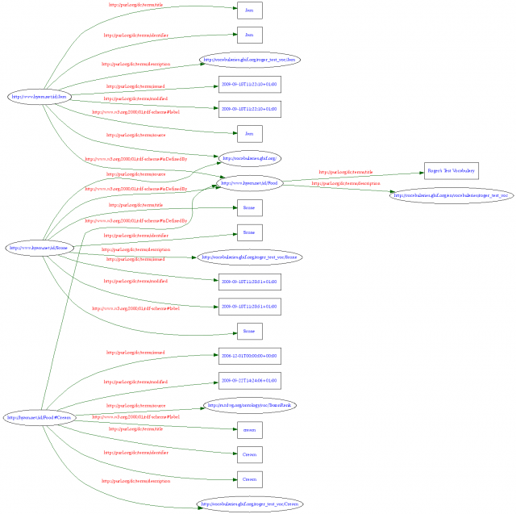

Several years ago I was involved in the developing the "TDWG Ontology". Quite what the TDWG Ontology was/is remains an enigma for many. Around 2005/6 we tried to move away from modeling things in XML Schema and into some form of frame based modeling with well defined classes and properties - as opposed to the document structures implied by XML Schema.  With the help of Jessie Kennedy's team at Napier and people around the world we started building an OWL ontology of the whole domain - then ran out of money.

We still needed basic terms for use in LSID RDF metadata. This lead to the  development of the [LSID Vocabularies](http://wiki.tdwg.org/twiki/bin/view/TAG/LsidVocs). These were very light weight "ontologies" but were still an attempt at defining terms using OWL.

In all our efforts there was a problem. There was no continuity of resourcing. For two years no one has been paid to manage the TDWG Ontology even though there is an increasing need for the disparate biodiveristy informatics projects to have a formal mechanism for defining shared terms. Because the resource is seen as common no one feels responsible to commit resources to manage it.

In the last few days I have been doing some work with [Kehan Harman](http://kehan.wordpress.com/) on establishing a technical fix for this.<!--more--> Kehan has been working for GBIF on a [vocabulary management system](http://vocabularies.gbif.org/). This system was originally envisaged as a method for internationalizing things such as drop down lists of countries and to provide a look-up mechanism for the GBIF Internet Publishing Tool.

Currently the GBIF vocabularies tool is not 'semantically enabled' so, although it tracks URIs for concepts, it does not provide RDF in response to those URIs. Indeed the URIs may not reside on a GBIF domain or be owned by GBIF. The tool's function is largely to provide translations for other people's vocabularies such as ISO [country names](http://vocabularies.gbif.org/en/vocabularies/country).

The GBIF tool is supported for the time being and is part of the GBIF infrastructure so, if we can prove its worth, it is likely to continue being supported. **Can we demonstrate how this tool could be used to manage the TDWG ontology and vocabularies?** If we can then perhaps we could persuade both organizations that this is a good way forward and thus facilitate active ontology management.

The first thing to establish is a separation between the notion of a URI that defines a concept within our domain and the attributes of that concept. The current LSID Vocabularies have the notion of a TaxonName (for a scientific biological name). This notion has the URI [http://rs.tdwg.org/ontology/voc/TaxonName#TaxonName](http://rs.tdwg.org/ontology/voc/TaxonName#TaxonName). Defined along with the basic notion of a name is the fact that TaxonName is also an OWL Class. It may be that two separate projects can agree on the fact that there is such a thing  as a TaxonName but they may disagree as to whether it is an OWL Class or not. One of the parties may simply have no comprehension of what an OWL Class is or need to know!

Because we currently define both the human notion of the concept and the technical description of it in the same place we limit adoption. It would be perfectly feasible, and I think desirable, to split these two functions in two. The first function would define the notion of TaxonName and associate it with a URI. This would be done by the GBIF vocabularies tool. The second function would define how TaxonName is used within a particular OWL ontology or within an XML Schema document. This would be done in conventional ways with OWL or XML files defined and hosted on a 'dumb' server.

The advantage of taking this approach is that it allows people who are not ontology gurus to take an active role in defining new and existing terms using the GBIF tool. Modeling experts can then define separate models for handling data in complex and interesting ways on the basis of the knowledge captured in the tool. The same concepts can be included in multiple models.

The danger is that people may not be satisfied with defining flat lists of terms and want to build more complex hierarchies. The strength is that, if they collaborate with modeling engineers, they can produce multiple, well versioned hierarchies that are more likely to be robust and comparable through time.

For this approach to work there are a couple of technical hurdles. Firstly the GBIF tool resides on a particular domain and is built using quite a complex Content Management System ([Drupal](http://drupal.org/about)). Meanwhile TDWG has 'ownership' of the rs.tdwg.org domain and this gives it a certain degree of independence that is useful as an independent third party when organizations wish to collaborate. We probably don't want to just point the rs.tdwg.org domain at the GBIF tool or ditch it in favour of a GBIF domain because:

- Machines accessing the RDF served up may bring down or hamper the GBIF tool.
- There is no redundancy should the CMS go down either accidentally or for maintenance.
- Switching to another ontology management system in the future may be problematic if the URI resolution is too tightly bound to the CMS

For these reasons a proxy that wrapped the GBIF tool to provide semantic web support for the URIs it manages seems like a sensible way forward and this is what we have developed to prototype.

The concept is very simple. A PHP script sits on the rs.tdwg.org server and an Apache mod-rewrite rule is used to route all requests for vocabulary terms through the script. The script has a simple mapping table that maps TDWG vocabularies to the associated web services in the GBIF tool. The vocabulary terms are defined within the GBIF tool using # based namespaces as is done now for the TDWG vocabularies.

When a URI for a TDWG vocabulary term is called it resolves to the PHP script on the TDWG server that then does the Semantic Web compliant content negotiation  with the client. If the outcome of this is to render human readable data then the client is redirected to the relevant page in the GBIF tool. If the outcome of content negotiation is to render RDF the PHP script calls the web service of the GBIF tool to get an XML rendering of the appropriate vocabulary. It then transforms this into RDF and returns it directly to the client.

To protect the GBIF tool and improve performance the TDWG server handles caching of the vocabulary RDF locally. Robustness is ensured by the script returning the last retrieved RDF should it not be able to contact the GBIF tool even if the cache time for that particular RDF has expired.

This all sounds far more complex than it is. We have therefore put together an example. The PHP script has been set up on this server and we have created a Food test vocabulary in the GBIF tool. There is the notion of Cream in the vocabulary and it has a URI of:

[http://www.hyam.net/id/Food#Cream](http://www.hyam.net/id/Food#Cream)

If you go to this URI in your browser you will be redirected to relevant page in the GBIF Tool.

If you go to the URI with a tool like 'curl' (if you are on Linux of Mac you can just open a terminal and type "curl http://www.hyam.net/id/Food#Cream") you will see an RDF rendition of the vocabulary. Unfortunately Windows isn't so developer friendly and doesn't come with a curl equivalent - go buy a real computer!

If you go to the [Linked Data validator](http://validator.linkeddata.org/vapour) and paste in the URI then it will explain to you how the resolution works between men and machines. There are some options there you can mess with as well.

If you paste the RDF you get into the [RDF Validator](http://www.w3.org/RDF/Validator/) then you get a graph like this.

This is proof of concept code and a bit buggy. For some reason the W3C RDF validator will not accept RDF directly from the URI due to an encoding problem. This may be there fault and can be ironed out I am sure. The GBIF tool is currently being migrated to Drupal 6 and may change in the near term.

What is needed now is discussion on if this is a good way forward. If it is then the current vocabularies would have to be migrated into the GBIF tool and the script set up. We could also decide on a mechanism for storing other ontologies that make use of these terms and express more complex relationships between them.

What do you think?

\[For those with a technical inclination here is a  [snapshot of the code](tdwg_ontology_proxy.zip)\]
