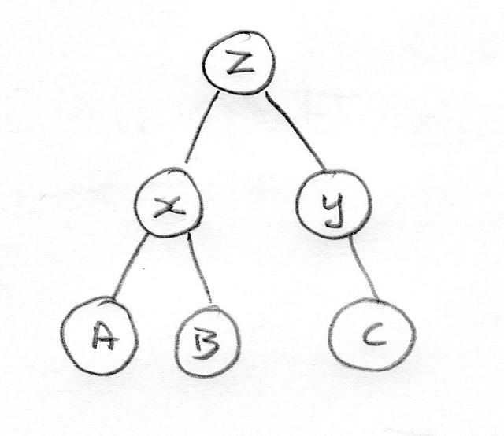
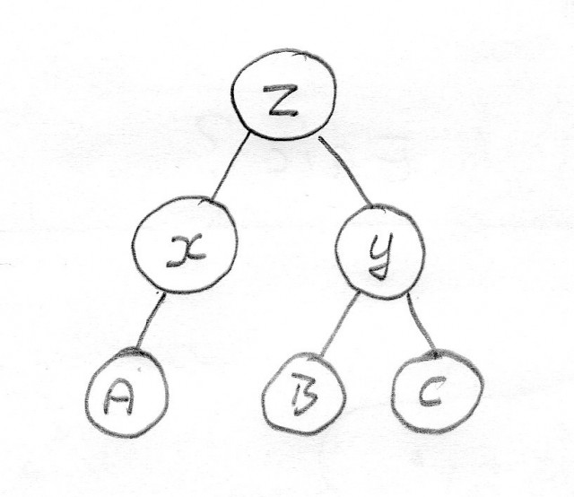

[")](http://www.hyam.net/blog/wp-content/uploads/2009/09/mushroom.jpg)

In this episode of our longest running soap opera Terry & Tina confuse Eric who takes off with Malcolm.

"Cabinets" is a public service broadcast with the aim of promoting  community understanding of [complex taxonomic issues](http://www.hyam.net/blog/archives/598).

\--- Cue opening credits ---

The story so far:**Terry** is a taxonomist and he works very hard to produce a classification of the family Z. It includes two genera, X and Y and three species A, B and C. Here is a picture of his classification.<!--more-->

Terry is pleased with his classification as it represents the state of knowledge in the group. On the next round of spending cuts Terry takes early retirements and goes off to play golf - job well done.

**Tina** is a very happy taxonomist because she gets Terry's old job. Not the whole job, they never replace complete posts, but just three days a week. After a few years she gets some more specimens in from family Z and decides that Terry's account was very good except species B should have been in genus Y not genus X so she publishes a revision where she moves the species and adds illustrations. Here is Tina's classification.

**Eric** is an ecologists and he has just discovered that things that look like they are species B or C play important roles in an ecological process - but he is confused. He wants to instigate a wide scale survey where his colleagues help him do some sampling. He has both Terry and Tina's accounts of family Z. He pops round to see Tina for some advice:

\--- Action ---

**Eric:** Hi Tina, I am confused. Can I combine results from my colleagues who have used Terry's classification with results where your classification has been used?

**Tina:** Yes sure. I didn't change the circumscription of B I just moved it from genus X to genus Y.

**Eric:** But then you changed the circumscription of the genera X and Y right?

**Tina:** No. I just moved the species.

**Eric:** I don't get this. I have people who have identified things to C in Terry's classification. Y was monotypic and so C == Y. Now, under your classification, C hasn't changed but it includes B. Y\* == (B + C). Either Y has changed or the things that were formally identified to C now have to be split between B + C.

**Tina:** Well I guess Y has changed if you put it that way because C definitely hasn't.

**Eric:** I am really sorry. I still don't understand. Species A has to have changed because it is now in a monotypic genus. Anything in X is now an A. Surely the genus description has some bearing on how we should interpret the species description?

**Tina:** Relax Eric. Generic and higher level taxon descriptions are generalized summaries of the species they contain. Species descriptions aren't specializations of generic descriptions.

**Eric:** So why did you move B from X to Y if it has absolutely no bearing on anything other than changing the name and making everyone's life more awkward?

**Tina:** Well more evidence became available in the form of new material that Terry didn't see. When I looked at it I concluded it was more closely (phylogenetically) related to C than A.

_**Eric Thinks:** Isn't there a contradiction there somewhere?_

**Eric:** But nothing changed? \[ pause \] Listen Tina, I need to think this through. I'll call you back.

Later that week, after his migraine has gone, Eric is playing golf with a friend when they meet Terry the retired taxonomist in the bar. Eric recounts the conversation and his confusion.

**Eric:** So what do you think Terry?

**Terry:** New fangled phylogentic and molecular sh\*\*\*! All a load of bull if you ask me like these here cataclysmic converters in cars causing global warming. It is the sun spots I say.

Eric concludes that Terry is enjoying his retirement and the beer but otherwise may not be helpful.

Several weeks later Tina is wondering how Eric is getting on. She thought he was rather cute and is concerned he didn't call back. So she calls him.

**Tina:** Hi Eric. How you doing? Did you solve your problem?

**Eric:** Oh hi Tina, thanks for calling. Yes we have a solution now. I met a guy in a bar down town - Malcolm the molecular biologist. We are simply bar coding 5% of the specimens we sample and extrapolating from these with morphological descriptions of our own making.

**Tina:** But what about correctly naming them? Do you need a hand with that?

**Eric:** No we aren't bothering with that. The sequences are going in GenBank and we are publishing the descriptions along with our methodology. There is no need for us to worry about hierarchies and nomenclature. They just seem to confuse things. People can repeat our work simply by following our methodologies and with no reference to Linnaean taxonomy. In fact we have concluded this approach is a lot more rigorous.

**Tina:** How about we meet up at the wine bar and talk some more about this. I was thinking of putting in a funding proposal to work on Z some more in the light of what you have said. Maybe we could go on for something to eat later?

**Eric:** Oh I'd love to Tina but I am meeting up with Malcolm tonight.

**Tina:** How about the weekend?

**Eric:** I am sorry but I am helping Malcolm move his stuff into my flat....

\--- Cue closing credits with shocked look on Tina's face ---

**Announcer:** Tune in to next weeks exciting installment written by one of our audience. If you would like to write for "Cabinets" please enter a comment below.
