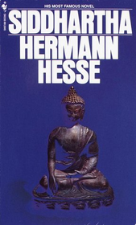

Amazon are selling an ebook of _Siddhartha_ by Herman Hess [for the Kindle](http://www.amazon.com/Siddhartha-by-Hermann-Hesse-ebook/dp/B002ZCYA1Q/ref=sr_1_1?ie=UTF8&s=digital-text&qid=1263221516&sr=1-1) for $3.51 and it appears in different versions for even more. _Siddhartha_ is out of copyright so it costs them nothing for the rights on this book. The $3.51 is all for them.

Does this mean that $3.51 is the cost of distributing an eBook through the Amazon system? That would imply that the publisher (nee the author) would get the value of any ebook that retailed for over this sum. With [_Zen and the Art of Motorcycle Maintenance_](http://www.amazon.com/Zen-Art-Motorcycle-Maintenance-ebook/dp/B0026772N8/ref=sr_oe_2_1?ie=UTF8&s=digital-text&qid=1263241978&sr=1-2&condition=used) by Robert M. Pirsig (which retails for $9.58 on Kindle) for example the authors would get $6.07? Somehow I doubt it!

That price tag of $9.58 doesn't compare very well with $10.19 for the [paperback version](http://www.amazon.com/Zen-Art-Motorcycle-Maintenance-Inquiry/dp/0060839872/ref=tmm_pap_title_0) of Pirsig's book.  The Kindle version can be yours in 60 seconds or less but it is controlled by Digital Rights Management (DRM) so really all you are buying is the right to have a permanent relationship with Amazon who will supply you with a copy to read on an authorised device. For 61c more you could have one made out of real paper that you could hand on to a friend or loved one, sell, donate to charity or even burn to keep warm. Sure it won't last forever but it still has a residual value. My paper copy is yellowing but perfectly readable. It was printed in 1978 (that is 32 years ago!). It has a price tag of £1 and I bought it from a second hand shop for £1.50 ($2 ish) about 10 years ago.<!--more-->

Because, unlike _Zen and the Art of Motorcycle Maintenance_, _Siddhartha_ is out of copyright you can get a legal non-DRM ebook copy from [FeedBooks](http://www.feedbooks.com/book/3374) and other places for free. You are free to do as you please with this. If you have an iPhone or iPod Touch you can use [Stanza](http://www.lexcycle.com/) to download a copy for free to your device in less than 60 seconds just like you can with a Kindle. Fortunately Amazon have released a Kindle reader for the iPhone/iPod Touch so you can have two applications on the same device that you can download the same book with. With the Amazon one you have to pay $3.51 for the privilege with the Stanza one you can do it for free. "Ah but the free one probably isn't formatted as well or something." I hear you say. Well you are wrong. It is the other way round. The text doesn't wrap correctly in the Kindle application. So Amazon are attempting to charge for something that is free (as in speech) and adding minus value to it. If you don't believe me and you have a iPhone or iPod Touch you can try this for free yourself as the first chapter of the Kindle version is free (as in beer).

Don't get me wrong. I am the kind of guy who gets excited about gadgets and I think ebooks are really important and going to be a major medium in the next few years. I like real books but would willingly do most of my reading off a gadget and reduce the clutter in my flat. Don't go assuming that I don't want to pay for anything either. I do that all the time. In fact I get an urge at least once a year to give [Steve Jobs](http://www.apple.com/pr/bios/jobs.html) lots of my money.

What I object to is people being ripped off. The thought that someone might pay $3.51 for a faulty version of something they could have for free bothers me. The thought that this process will encourage people to break copyright on works by living authors and so rip them off also bothers me. If _Zen and the Art of Motorcycle Maintenance_ was available as an ebook for half the paper back cost and [Robert Pirsig](http://en.wikipedia.org/wiki/Robert_M._Pirsig) got most of the money then it would seem like a good deal. As it is Amazon (and probably other publishers) are setting the precedent that it is OK to rip people off. It is hard for them morally to turn around and condemn someone who scans and distributes copyright works for free. Sure they can do it legally but they have lost the battle for 'hearts and minds'.

My hope is that the publishing industry (the bit between authors and readers) will see sense and rapidly move to a position where ebooks are available at reasonable cost - perhaps DRM free. Their role is to add value that can be charged for. If they charge more for the value they add than it is worth then the market will find a way around them. Exciting times!

Amazon have
