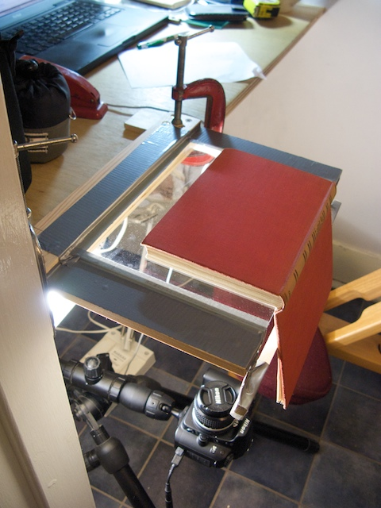
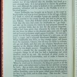

\[caption id="attachment\_771" align="alignleft" width="161" caption="Almost Free Scanner"\]\[/caption\]

In the last weekend of the Christmas break I was sat in Starbucks in Waterstones in Edinburgh considering which of a stack of potential books I was going to spend my Christmas book tokens on. I had just been playing with a Sony eBook reader and so was thinking maybe I should take the plunge and go digital with books as well as the rest of my life.

I wondered what I would do with my existing books. It would be nice to be able search through these and have them all with me when I travel. There would be issues with copyright if I were to copy them but there would also be technical problems. How would I get them in EPUB or PDF format? I did some Googling and came across a great site [diybookscanner.org](http://www.diybookscanner.org/). There are some really innovative designs on this site and it got my obsessive thoughts going. There were two problems.

- I only had 48 hours to play before going back to work and my wife and kids wanted some of that time.
- I didn't have a workshop. Just a desk and some simple tools.

Could I produce a scanner in that time? Would it work?<!--more-->

Most of the plans on [diybookscanner.org](http://www.diybookscanner.org/) are pretty complex involving placing the book on a stand on a table and having multiple lights and cameras pointing down at it. I don't have a table. At least I don't have a table that isn't already filled with stuff. So the design I came up with (pictured) turns the system upside down and puts the camera on a tripod near the floor. A frame made from some scrap wood holds a piece of glass from a clip picture frame. The camera is on a tripod on the floor. This is like some photocopiers for books. Lighting is provided by a desk lamp (fluorescent tube) under the desk at approx 45 degrees to the glass.

Setting up involves lying on the floor on your back to focus the camera and line it up with the page. This may be the usability issue that will prevent me commercialising it!

\[caption id="attachment\_778" align="alignright" width="150" caption="Example Page Image"\]\[/caption\]

In operation I have an electronic cable release on the floor that I press with my big toe keeping both hands free to manipulate the book. I take the right page, turn the book round and take the left page (the other way up), pick the book up and turn the page, repeat right and left. I did a 228 page book in under 30 minutes like this. The book was _Gotama The Buddha_ by Ananda Coomaraswamy which I believe is out of copyright.

The resulting images are sideways on and need to be rotated 90 degrees alternately left or right. I wrote a PHP5 command line script ([process\_src.php](process_src.php_.zip)) to do this. It will also do simple cropping. There is an example page image shown.

This combination means I can get from physical book to page images pretty quickly for a small book. I can flick through the pages on my laptop but they are nothing without OCR and I have run out of time! The brief attempts I have had at OCRing some of the page images have been pretty disappointing.

Is the OCR the achilles heal of the process? If I did get good OCR how easy would it be to get the text into re-flowing [EPUB](http://en.wikipedia.org/wiki/Epub) or similar format. These will have to be the subjects of more thought and perhaps more experimenting if I find the time.

One thing is for sure - I have more of an appreciation for the imaging process and eBook world.

Note: I do not condone the breach of copyright. Authors deserve paying for their work

**Important Note: Be very careful if you try and make one of these as you end up with a piece of glass strapped to the edge of a table which is dangerous - particularly with kids around. Put a guard on it when you aren't using it**.
