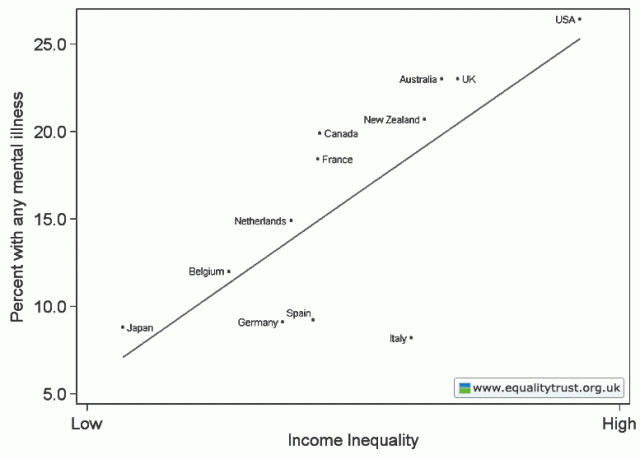

[This page](http://www.nhs.uk/conditions/depression/pages/prevention.aspx) on the NHS England website claims that eating fish oils (_long chain_ Omega-3 I assume rather than any Omega-3) help prevent depression. It says:

> **Omega-3 fatty acid**
> 
> Research has shown a link between the amount of a fish people in different countries eat and the level of depression. In Japan, where people eat on average 70kg (150lbs) of fish a year, the rate of depression is 0.12%. Whereas in New Zealand, where people eat only 18kg (40lbs) of fish a year, the rate of depression is almost 50 times higher.
> 
> It is though that a chemical found in fish - omega-3 fatty acid - may help your brain work more efficiently, so serotonin (which can boost your mood) has more of an effect on you.
> 
> Fish that contains a lot of omega-3 fatty acid includes salmon, sardines and mackerel. Vegetarian alternatives include walnuts and tofu, and omega-3 food supplements are also available over the counter (OTC) from health shops.

I don't think this would get through on Wikipedia. "Research has shown" are weasel words if you don't say who's research and where. This is a shame because on the same site is a [well balanced report](http://www.nhs.uk/news/2009/10october/pages/mediterranean-diet-and-depression.aspx) on a reasonable study of whether a mediterranean diet prevents depression. The contradiction between these articles is interesting.

To show how ridiculous the fish oil claim - that people in Japan are less depressed because they eat more fish -  real is consider the graph below (taken from the [EqualityTrust.org.uk](http://www.equalitytrust.org.uk/) site - a great site go and [donate now)](https://www.e-activist.com/ea-campaign/clientcampaign.do?ea.client.id=118&ea.campaign.id=3741).

\[caption id="attachment\_808" align="aligncenter" width="640" caption="Income Inequality vs Mental Health from Equality Trust"\]\[/caption\]

It shows that there is a correlation between mental health and inequality and that New Zealand is a 'worse' place than Japan for mental health 'because' NZ is a more unequal society. Is there are causal link between fish consumption and income inequality I wonder?

Given the choice between depression being caused by a chemical imbalance and  depression being caused by a more complex set of social (even ethical or religious) conditions it is easy to see which the market would prefer to respond to. Eat more fish! Take these supplements!

I have a load of material on the fish oil 'conspiracy' that I'll have to find time to post. In the mean time if anyone has actual scientific research showing that eating fish makes people happy (other than just because they like the taste) I'd love to see it.
