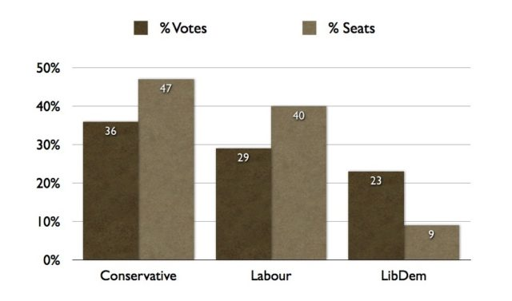

This is the graph you will not see presented often in the media - I had to make it up myself. It shows the proportion of the vote and the proportion of seats in the House of Commons **both plotted together** from the results of the May 2010 election (649 seats declared).

The Conservatives only got just over a third of the votes but they got nearly half the seats. Labour got 40% of seats with less than 30% of the votes and the poor old LibDems only got 9% of seats with 23% of the vote. 52% of people voted for a left of center progressive party of some kind ( a lot more if you think of the Greens and various flavours of Socialist and Communist) but we are headed for a right of centre government.

I am afraid the UK is not a democracy in my mind. Yes the Conservatives are the largest organised group but this is tantamount to government by a minority.

In Scotland fewer than 1 in 6 people voted Conservative yet we will end up being ruled by them - this makes a very strong case for independence.
