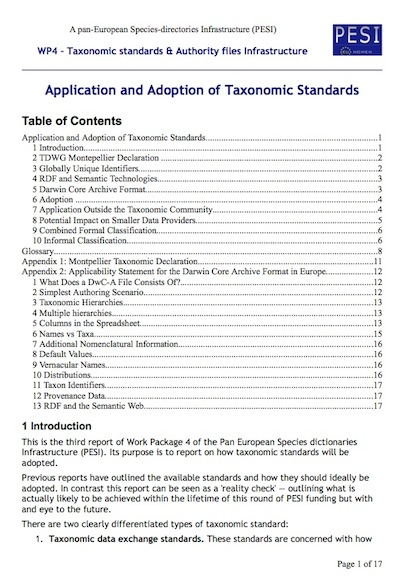

I finally submitted deliverable D4.3 for the [PESI](http://www.eu-nomen.eu/pesi/) project and in the great tradition of putting my outputs on my blog here is a PDF copy: [Application and Adoption of Taxonomic Standards](http://www.hyam.net/blog/wp-content/uploads/2010/05/PESI_WP4_D4.3_App_Adopt_06.pdf).

This will be of interest to those involved in taxonomic and nomenclature projects as it shows our collective attempts to get to grips with GUIDs and RDF probably in a more political than technical sense. It advocates the use of [Darwin Core Archive](http://code.google.com/p/gbif-ecat/wiki/DwCArchive) format as proposed by the [GBIF](http://www.gbif.org/) ECAT project.
