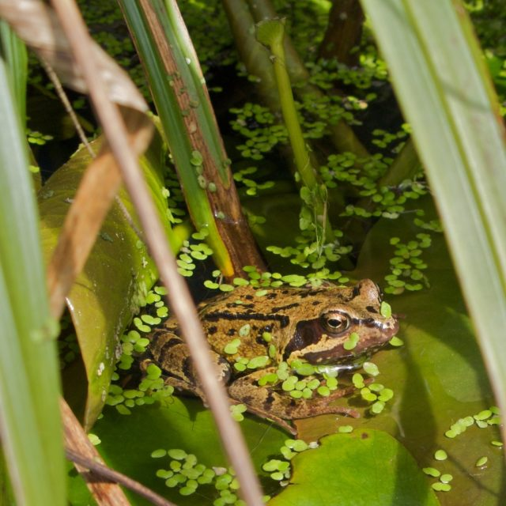

\[caption id="attachment\_860" align="alignleft" width="188" caption="The Frog in the Pond"\]\[/caption\]

Sometimes two things cross your desk at the same time and they say more than either one of them would on their own.

Firstly I was looking for a list of British birds and happened across the [British Ornithologists' Union](http://www.bou.org.uk) (BOU) [list of bird names](http://www.bou.org.uk/recbrlstbni.html) and how they have changed between 1923 and 2007. This is most delightful list as it shows the English names are as stable as the scientific names - or both are equally unstable. If it hadn't been for an attempt to standardise the use of the hyphen the English names would have been much more stable in my opinion (though by no means totally static). Here is a quote:<!--more-->

> English vernacular and international use names have proved more stable than scientific names in recent years (see the changes to the scientific names of terns hirundines and tits in Sangster _et al_ , 2005, _Ibis_ 1 47: 821-826 – this paper alone contained 15 changes to the 29 scientific names of species across these three groups, with no changes to any of the 29 English names) and will probably continue to be more stable as ongoing taxonomic research is more likely to see changes to scientific names than it is to English names.

It is easy to see why the BOU should rate English names equally with scientific names. It is also interesting to see that there is no consideration of splitting or merging of taxa here. They are only looking at the names they call (presumably indisputably stable) entities. They map names to names.

The second thing to cross my desk was the publication of a David Hawksworth's  [Terms Used In Bionomenclature](http://www.gbif.org/communications/resources/print-and-online-resources/bionomenclature/). This is a very useful book indeed for those trying to get to grips with the different codes of nomenclature and how they have been applied. Here's the quote:

> This is a glossary of over 2,100 terms used in biological nomenclature - the naming of whole organisms of all kinds. It covers terms in use in the current editions of the different internationally mandated and proposed organismal Codes; i.e. those for botany (including mycology), cultivated plants, prokaryotes (archaea and bacteria), virology, and zoology, as well as the Draft BioCode and PhyloCode.

At over two thousand words this is quite some vocabulary of technical terms. To get a handle on how expressive this is compare it with [Basic English](http://en.wikipedia.org/wiki/Basic_English) which has under a thousand words. This quote from the Wikipedia page:

> The 850 core words of Basic English are found in Wiktionary's _[Appendix:Basic English word list](http://en.wiktionary.org/wiki/Appendix:Basic_English_word_list "wikt:Appendix:Basic English word list")_. This core is theoretically enough for everyday life. However, Ogden prescribed that any student should learn an additional 150 word list for everyday work in some particular field, by adding a word list of 100 words particularly useful in a general field (e.g., science, verse, business, etc.), along with a 50-word list from a more specialised subset of that general field, to make a basic 1000 word vocabulary for everyday work and life.

So you can get by in **everyday work and life** with 1000 words but a specialist vocabulary twice the size is needed for a system of scientific nomenclature which **fails to produce stable names for everyday objects** (British birds).

Last time I visited my mother-in-law she asked me what I did for a living and, for the umpteenth time, I tried to explain. I am finding it becomes harder to justify these things even to myself. Nomenclature seems to be a kind of [Glass Bead Game](http://en.wikipedia.org/wiki/The_Glass_Bead_Game) only loosely connected to the real world. The real action is probably in [barcoding](http://www.boldsystems.org) and [metagenomics](http://en.wikipedia.org/wiki/Metagenomics).
