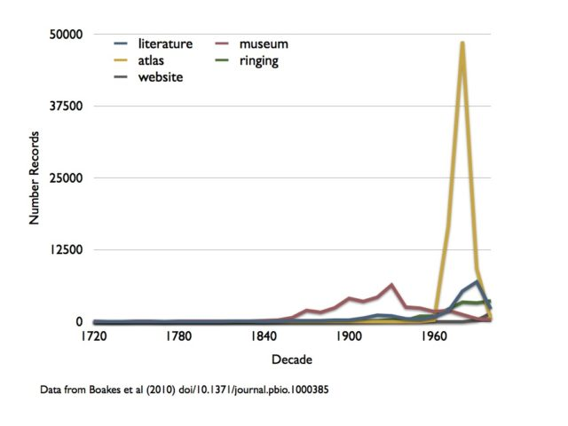
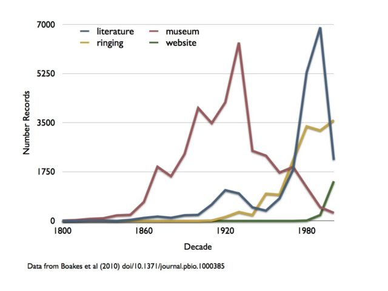

Checking the news this morning I came across an interesting article that implied citizen science was incredibly important going forward. [Citizen science 'can safeguard birds' future'](http://news.bbc.co.uk/1/hi/science_and_environment/10206710.stm). This article is based on a recent paper by Elizabeth H. Boakes _et al_ in PloS Biology "[Distorted Views of Biodiversity: Spatial and Temporal Bias in Species Occurrence Data](http://www.plosbiology.org/article/info:doi/10.1371/journal.pbio.1000385)" doi/10.1371/journal.pbio.1000385. Which is not only publicly visible but also publishes its data!

This paper on data bias was particularly interesting but probably for the wrong reasons.<!--more--> The authors repeatedly make the case for museums being a good source of data and, by implication, being a good source of occurrence data. I don't think this is true and, because they kindly published their data, I have the opportunity to show my thinking with two graphs.

\[caption id="attachment\_877" align="aligncenter" width="640" caption="Number of Occurrence Records Per Decade For Each Data Source"\]\[/caption\]

This first graph shows a plotting of Boakes e_t al_'s data to show how many occurrence records were created for species of Galliformes (partridges, pheasants, and quails) in each decade from each type of data source they considered (total around 140k records. I have omitted the handful of records prior to 1720). It can be seen that there is a very large peak in the 1980s for the atlas type data source. I believe this is due to very few publications and skew the results quite a lot so lets look at the same graph without that data source.

\[caption id="attachment\_878" align="aligncenter" width="640" caption="Occurrence Records Per Decade For Each Data Source (Atlas removed)"\]\[/caption\]

I have also truncated the second graph at 1800 - nothing much happens in the data before that point. You can see the big peak in museum records from the mid 19th century to the mid 20th century - the age of discovery!

But what does the size of this peak mean? At its highest point in the 1930s it is less than 7,000 records - in a decade - from 121 museums! Getting those records didn't only incur the cost of collecting the specimens but of curating them for nearly 100 years and then digitising the data and that data isn't even very accurate! How many records could a small team of para-taxonomists with GPS receivers collect in the time it takes to digitise the rest of the specimens in those collections? Should we do a cost benefit analysis of this? Does a small amount of inaccurate data from 50-100 years ago out weigh large amounts of highly accurate data from today?

I am **not** saying museums are unimportant (they are crucial for taxonomy and systematics) but I am saying they are probably not a good source of the high quality occurrence data needed to do assessments of today's biodiversity. All the museum records found in this study amount to < 36k records. The study took around 1,500 person-days of data gathering for 140k data points which is around 12 records per hour per person (7.5 hour days) - just to find existing data and much of that is accurate to less than 10 miles. This is not considering temporal accuracy (what date and what time of day was the sighting) or altitude (which is a major indicator for climate change).

It would not be acceptable to publish a paper suggesting one form of data gathering should be favoured over another - especially if that recommendation might lead to even less funding for cash strapped museums and herbaria. Data from websites and ringing studies are rising rapidly.  As the authors point out highly automated data gathering is the future. But what they don't say is the negative side of this - that we should not waste too much time trying to read older specimen labels - unless we are actually revising the taxonomy and even then the value is debatable.

The data I used to plot these graphs is available as => [plotting\_data.csv](plotting_data.csv_.zip)

\[EDIT 8/6/2010\]

If you like/hate this you may also be interested in this: "Biological collections and ecological/ environmental research: a review, some observations and a look to the future" Graham H. Pyke and Paul R. Ehrlich Biol. Rev. (2010), 85, pp. 247–266. [doi:10.1111/j.1469-185X.2009.00098.x](http://dx.doi.org/doi:10.1111/j.1469-185X.2009.00098.x)
