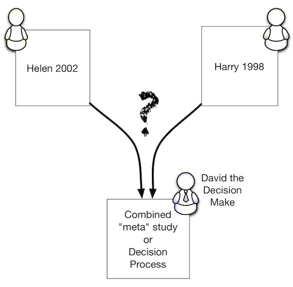

I have been around and around this thing over the past few years and it all comes down to a simple use-case. I thought I would present it graphically here:

\[caption id="attachment\_932" align="aligncenter" width="584" caption="The Simplest Use-Case for Taxonomy?"\]\[/caption\]

David is a decision maker. He wants to use data from two studies, Helen 2002 and Harry 1998. Is it safe for him to combine studies if:

1. they both use the same taxon name? Maybe - but only if David can be certain the circumscriptions of the taxa used in the two studies were sufficiently similar to satisfy  the needs of his own study. i.e. this can't be known _a priori_ to David's study.
2. they use different names but the names were considered synonyms of each other? Again it is David's judgement whether the two **concepts** used were sufficiently similar - independent of the names used.

It looks like David has to stop being a decision maker and do some taxonomy in every case where source data studies have not gone out of their way to explicitly state that they have used the same identification methods.

How does the work we are doing with persistent identifiers and building big names/nomenclatural databases help solve David's problem? We can help him find material to make his decision but if the result is just textual descriptions and images we can't automate his decision at all. Google and other search based approaches are pretty good at finding material based on scientific names.

Helen and Harry could have helped out if they had cited the identification key they had used - this doesn't need a database of all identification keys it is a simple literature citation.

David could make the assumption that anything that has the same name or is a synonym of something with that name is the 'same' but this involves taking a _sensu lato_ approach to every species.

If there were some absolute way to describe the taxa then perhaps the process could be automated. If, just as an example, Helen _et al_ and Harry had produced DNA barcodes then David could make the assumption that anything that had the 'same' (or sufficiently similar) barcode would be treated as being the 'same' in his study. Without this kind of mechanism (and we don't have it in plants) I am at a loss to see how we can help the poor guy out - he must become a taxonomist at least part of the time. Any suggestions?
