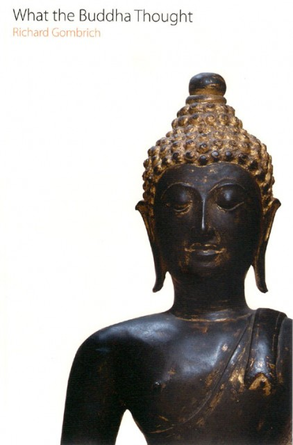

It took two transatlantic flights but I have just finished "What the Buddha Thought" by Richard Gombrich. I was inspired to read it by my boss, Charles Hussey, who kindly took me to a lecture for the old boys o[f St Paul's School](http://www.stpaulsschool.org.uk/) in London given by Richard.

My first piece of advice is - if you want to know about Buddhism don't read this book. Go and read a few of the multitude of introductions.

My second recommendation is - if you think you know about Buddhism **do** read this book.

Richard Gombrich writes in a very straightforward, accessible style but the arguments he proposes are complex and require some thought and prior knowledge. He takes an scholarly approach to unearthing what the Buddha was thinking which is both refreshing and somewhat frustrating. As a aspiring 'practitioner' (I don't like that word but it seems to fit) I am keen to Know what the Buddha experienced and part of this is knowing how and what he thought. Richard provides a wealth of material evidence (his detractors may say too much opinion) as to the context of the Buddha's life and how we can interpret the canonical literature in this light.<!--more-->His observations on the use of wit and satire by the Buddha are particularly thought provoking. After reading the book I feel I have a closer relationship with the historical Buddha or at least the image of him in my mind and for this I am most grateful.

My frustration is born of Richard doggedly sticking to his academic guns and not stepping into the experiential side. To understand what the Buddha 'thought' we really do need to know something of what he 'experienced' and, if we believe what the Buddha said, that experience is open to us if we practice. I find, for example, that I can agree whole heartedly with how karma is described in the book but simultaneous have a 'modern' opinion of rebirth - or rather the lack thereof. I believe I can take this approach because of my practice rather than literally interpreting the teachings. If you read the book you would see that accusing Richard of being too literal is rather ironic on my part....

This is probably destined to be one of the books I guard for reference and don't lend out.

Most recommended.
