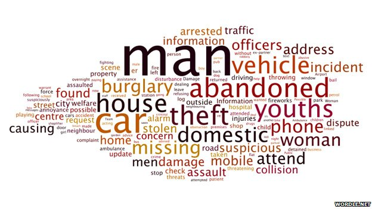

Look at the [Wordle](http://www.wordle.net/) above. It was produced from Tweets of all the [Greater Manchester Police](http://www.gmp.police.uk/) incidents over a 24 hour period. I pinched it from [this BBC new article](http://www.bbc.co.uk/news/magazine-11552419). What is remarkable is that the article does not mention the biggest word in the Wordle. It looks to me that the main reason people ring the police is because something is either happening to a man or a man is doing something. I suspect the latter. Why doesn't the journalist comment on this? If you are a man how does it make you feel? Perhaps our problems as a society revolve around what men are doing or perceived to be doing. There are almost twenty times more men in prison than women. Are men genetically twenty times more likely to be bad or do we bring them up to be bad? Imagine being born with a twenty times greater disposition to commit a crime than your sister? Doesn't sound right to me.
