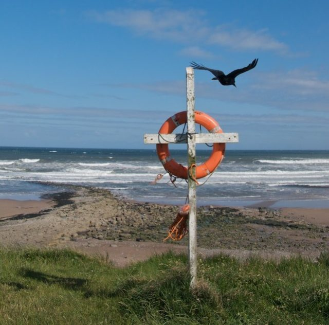

I am not sure how to say this. Either:

1. I just had my first [Nature Precedings](http://precedings.nature.com/) paper published.
2. I just published my first paper on Nature Precedings.

The distinction is a big one. Saying I had a paper published implies the blessings of my peers. This is more like vanity publishing or even 'stupid' vanity publishing as the whole thing is open to comments and voting. My inflated but fragile ego will likely get punctured by negative comments or worse (and more likely) by total apathy.

I did some work last year on merging occurrence status vocabularies for the PESI project and, as I really wanted to make use of [OWL](http://en.wikipedia.org/wiki/Web_Ontology_Language) in some way, I attempted to do this by creating a set of related ontologies then using inference to produce a magical-semantic-merging of them all. As this was a new thing for me I wrote it up as I went along.<!--more-->

You can read my conclusions in the paper on Nature Precedings:

> [The use of Web Ontology Language (OWL) to Combine Extant Controlled Vocabularies in Biodiversity Informatics Appears Redundant](http://precedings.nature.com/documents/5168/version/2)

It even has a DOI!! - doi:10.1038/npre.2010.5168.1

Why Nature Precedings? My conclusions were mainly negative and no one likes a downer of a paper so it sat in the virtual filing cabinate until I came across it yesterday as I clear out for the end of my contract. I could have started the process of trying to get it in a regular journal but the peer review would be painful. There is so much here that we could talk about for days on end and if I got chatty reviewers then it could take up a large amount of my unpaid time without actually improving the paper very much. If those conversations are going to happen they may as well happen on Nature Precedings where they add to the paper directly.

I will certainly cite this as a publication on my CV and people will be able to click on a link and read both the paper and what other people think of it. For me this raises questions about the purpose of peer review outside the clinical research.
