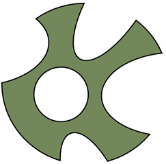
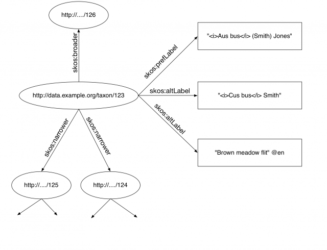
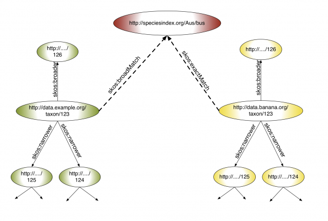

Last year I did some work on a prototype system called speciesindex.org but have just taken it down and abandoned the idea. You may have reached this post via the speciesindex.org domain as it will probably resolve to here until I use it for something else.

Here is how speciesindex.org was described on its one and only page:<!--more-->

> This service allows you to create an HTTP URI for any named biological taxon. It works very simply.
> 
> - You follow a **simple set of rules** to create an [HTTP URI](http://en.wikipedia.org/wiki/Uniform_Resource_Identifier) (also known as a URL) based on the name of the organism.
> - You use the resulting URI to mark up your data - particularly if you are using RDF.
> - Anyone else who follows the same process will create the same URI for their data.
> - Machines will know that the two sets of data are about the same taxon because they use the same URI. There is no more confusion around the correct way to cite a name.
> - If any person or machine calls the URI (puts it in a web browser for example) the website will respond by saying the equivalent of "This URI represents a taxon with the name ... " and it will use the **simple rules** backwards to work out what the name of the organism is.
> - If the name of the organism is totally unambiguous this site may add some extra**nomenclatural** data from other sources (such as Index Fungorum, IPNI and ZooBank) that isn't encoded in the URI.
> - This site will **never assert anything about the taxonomy or classification of the taxon**. This is the 'unique selling point'. You can express synonymy or placement in a classification in your data and your colleagues can express something different in their data but you can have the common ground of a shared URI.
> 
> Speciesindex.org's principle aim is to encourage people to use the same URI when they are talking about something in common.
> 
> Speciesindex.org is hardly original. People have been embedding taxon names in URLs since time began (probably 1995). This is just a refinement of the approach.
> 
> There is no data held by speciesindex.org it is just a service so until data is made available that uses the Species Index URIs the service is more or less useless. [data.speciesindex.org](http://data.speciesindex.org/) has therefore been created to host seed data that makes use of the URIs and allows people to start creating ontologies and applications. Visit [data.speciesindex.org](http://data.speciesindex.org/) for usage examples.

Here is a PDF of the whole page so you can read all the details if you like: [Species Index - A URI for every Taxon](Species-Index-A-URI-for-every-Taxon.pdf)

Here is a PDF of the data.speciesindex.org page so you can see what was there: [Species Index - Data](Species-Index-Data.pdf)

Here is a ZIP file of the all the code and the data that wasn't in a database: [Speciesindex Archive Zip](speciesindex_archive.zip)

I was thinking that I would introduce this concept at [TDWG 2010](http://www.tdwg.org/conference2010/) but realised that I would have to move  it away from using the TDWG vocabularies altogether  and onto using the core SKOS vocabulary to complete it. I didn't have a chance to do this prior to the meeting and I was not sure how my approach would go down. I decided to wait and judge the lie of the land before proceeding. I didn't have the energy to suggest that we could build a integrated global system based on existing vocabularies and not only not invent anything but also throw some stuff away. Generally we like to invent things at TDWG and definitely not throw things away.

Let me explain how I envisaged this system working and then say why I don't think it is practical.

My take on the problem of sharing taxonomic information on the web is that numerous projects, individuals and institutions have their own classifications. They work hard to produce these synonymised hierarchical checklists. The biggest example is probably the [Catalogue of Life](http://www.catalogueoflife.org/) but there are many smaller ones. This view of the world is supported by David Remsen and Markus Döring at [GBIF](http://www.gbif.org/) (among others) who are building [Checklist Bank](http://www.gbif.org/informatics/name-services/checklist-bank/) which will allow people to deposit annotated checklists and classifications (more on this later).

How would we do this in a distributed fashion on the linked data web? If we lost our inhibitions about taxonomic data being "special" we could use [SKOS](http://www.w3.org/TR/2009/NOTE-skos-primer-20090818/) and treat classifications "just" as thesauri of terms.

For the past ten years I have been talking about biological classifications as if they were collections of nested sets and getting very frustrated that working taxonomists didn't actually act like they were. It would make me mad that no one took any notice of taxon concepts and it didn't seem to matter very much in the 'real world'. Attempting to model the way taxonomists work in OWL is just frustrating and liable to lead to a mess we can't understand even if we can get it 'right'.

If we used SKOS a classification would look something like this:

This is a simple hierarchy of terms with a preferred label lacking a language tag as the actual Latin name (note the embedded markup) and synonyms and vernaculars as alternate labels - with language tags indicating which are vernaculars. We could make this a great deal more complex by using the SKOS label extensions to do homotypic type relationships but I would argue strongly that this is not worth the effort as these SKOS thesauri are the **products of taxonomy** and should only present a distillation of the process.

The trouble is if you produce a SKOS thesaurus of your taxonomy and I produce a SKOS thesaurus of my taxonomy  and they overlap in some way we have no way of knowing it other than by matching the strings in the labels and by knowing about each other. A system that requires everyone globally to know about everyone else is doomed to failure. This is where speciesindex.org would come in. If we had a trusted third party we could both link to them and any consumer of our thesauri would know how WE thought they **might** be related.

So what we do is link to a arbitrary concept that is based on the name. In the example above the author of the green classification thinks that his concept is narrower than the generic way the name is used whereas the author of the yellow classification thinks theirs matches it exactly.

Thus we have a global system that requires little effort to set up but allows integration of multiple taxonomies through time. These thesauri can be used to do things like query expansion but what else?

So why is this impractical?

For it to work we would need to get many people to adopt it. To do that we would have to explain it over and over and over again. People would come up with a million "yes buts" (you probably have a few of your own) and there would be no way to weed out which "yes buts" are good ones and which are not because we don't have a strong use-case for how this would all be exploited by real live human beings. Why should I publish my data like this when there is absolutely no tangible benefit for me today? We would need to build a tool that did something like allow you to open several classifications simultaneously and use them for organising the data on your hard drive - and that would take effort - plus does anyone actually need it?

The bottom line is most of the functionality you would likely get out this system you will be able to get out of Checklist Bank pretty soon anyhow. These taxon names we are dealing with are really just social tags that need to be organised in a central place. A combination of Checklist Bank and the Global Names Index more or less does the job just with analysis of name strings.

It is impractical because nobody wants or needs it!

Anyone want to buy a domain name?
