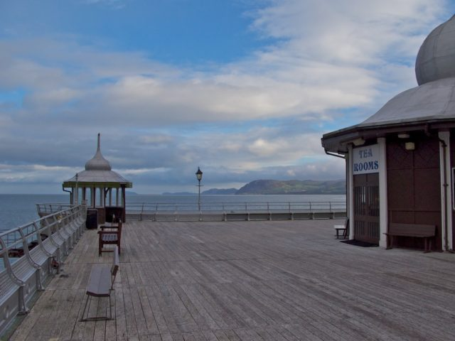

Wonderful weekend. Voluteered for EEG experiment on Thursday. All day [John Peacock](http://www.gaiahouse.co.uk/page.php?id=105#John_Peacock) lecture on Friday covering the early Buddhist background to mindfulness. Foundation module on Saturday and Research module Sunday.
