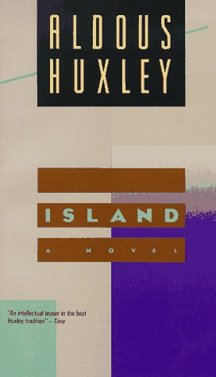

[BBC Radio 4](http://www.bbc.co.uk/radio4/) have a programme called the [Moral Maze](http://www.bbc.co.uk/programmes/b006qk11) in which a small team of people question expert witnesses and discuss the moral aspects of a particular topical issue. I don't usually listen because it typically produces 'more heat than light' with people shouting things like 'It is me that asks the questions!'.

Last night I did listen because the programme was inspired by the proposal to have a national measure of General Well-Being (GWB). The debate was framed around: ["Setting aside the question can you measure happiness - the moral question is should you?"](http://www.bbc.co.uk/programmes/b00xhj84)

The standard of debate was very low. The team seemed to be particularly ill informed - almost ill educated. Here are a few points that jumped out at me:

1. [**The Straw Man Fallacy**](http://en.wikipedia.org/wiki/Straw_man) Discussing whether we should measure happiness may not have anything to do with a GWB index. Proponents are usually very careful not to mention the H word. Taking this as the subject of the debate is a cheap journalistic trick. Either the editors don't understand the concept of GWB or they don't think that it would make good radio. I suspect a little of each.
2. [**Leading Question**](http://en.wikipedia.org/wiki/Leading_question) "Setting aside the question can you measure happiness...". Not only is no one proposing we do this it is actually quite common to measure moods of different kinds and even induce them is the laboratory. There are decades worth of scientific literature showing this. Making this statement at the start of the programme they are attempting to undermine the proponents with a statement that they are not allowed to debate.
3. Misrepresentation of [Aldus Huxley](http://en.wikipedia.org/wiki/Aldous_Huxley) The point was made that the savage in Huxley's "Brave New World" was fighting against state imposed happiness and this some how illustrates how the state should not get involved in happiness at all. This is why we talk about well-being not happiness (straw man again). The state in "Brave New World" does not give a damn about peoples well-being it just wants them to keep consuming and not cause any trouble. It does this by keeping them wanting stuff and keeping them drugged up - which seems a very familiar model. We live in a sea of advertising. At this very moment at least 10% of the population are on antidepressants and one in four of us have been on them at some point in the past. The majority of adults drink to relax many every day. The consumer society **is** the "Brave New World" of Aldus Huxley and the people who choose to go and live in monasteries are seen as the nutters - the savages. Funnily enough Huxley wrote another novel called "Island" which portrays a Utopian society where the well-being of all is central. It is a depressing book as the society is destroyed at the end by the market orientated external world. It is odd how "Island" is never mentioned. I guess they don't do it on humanity courses and it is deemed unsuitable for school children because of the use of psychoactive drugs.
4. ... I could go on all day but would have to listen to the programme again and that would be just too painful...

Come on BBC let us rise above the tabloid level of debate.
