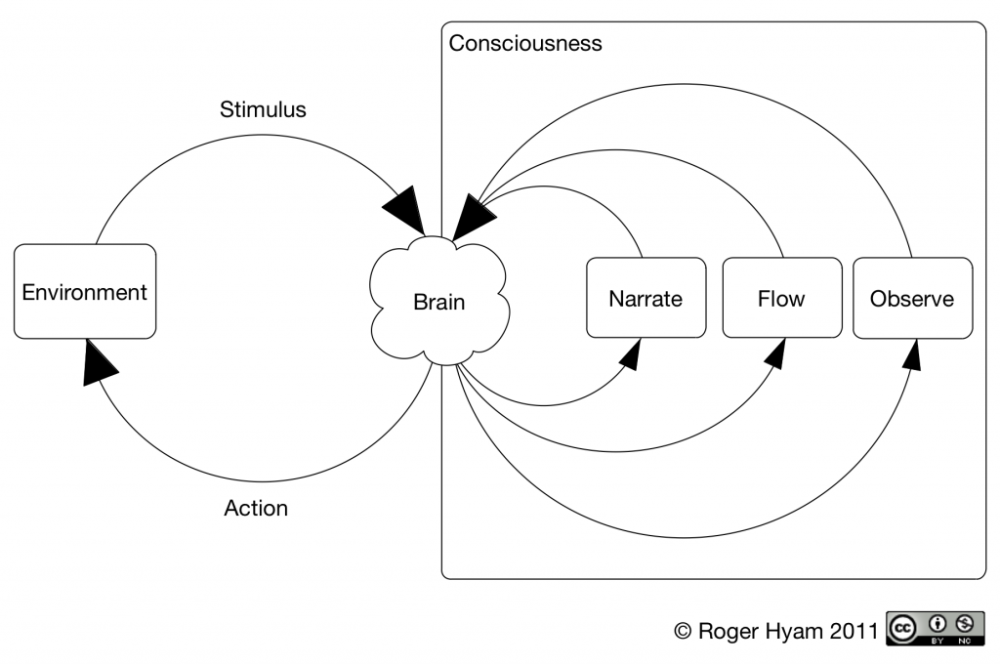

I was trying to explain how secular mindfulness worked to a friend and I drew the diagram below. It occured to me later that this may be a novel description of how mindfulness based interventions operate and warrants further study. I found that each of the papers I was reading could be mapped onto this model with varying degrees of success and that this might have implications for the way interventions were designed.

This blog post presents the model. As time permits I will create other posts that discuss the relationship between this model and those proposed in the literature. I'll link to all subsequent posts from this one.

## The Model

Like a map, a model is a representation of a more complex reality designed for use in a particular context. The model proposed here is shown in the figure above. It is intended for discussion of concepts around the secular use of mindfulness. It is not a general model of psychological processes.

The model consists of five processes represented by boxes – 'brain' here refers to the processes in the brain and 'environment' to the processes in the environment. The five processes are linked by a total of eight relationships shown by arrows. Four principles (that are not shown in the figure) govern how the model operates. What follows is a didactic description of the model. Justification comes in its ability to account for the mindfulness construct as presented in other works. These will follow in subsequent blog posts that will be linked to below.<!--more-->

At the centre of the model is the brain. This can be thought of as the entire central nervous system. On the left of the diagram is the environment which represents the entire physical world outside the brain. There are two relationships between the environment and the brain. Stimuli in the environment affect the brain and actions instigated by changes in the brain affect the environment. Everything that happens on the left hand side of the model occurs outside consciousness.

The right hand side represents the conscious mind. Consciousness is taken as an emergent property of brain processes. Note that physically consciousness may be thought of as occurring within the brain but, as this is a conceptual model not a physical model, its is drawn outside of the physical structure i.e. emergent from it. The inputs into the brain come as both stimuli from the environment and as feedback from the three processes within consciousness.

The environment only affects consciousness via the brain and consciousness only affects the outside world via the brain. Whether or not consciousness lags behind external reality by some amount of time (Soon, Brass, Heinze, & Haynes, 2008) it must still be preceded by and followed by unconscious processes. We are not aware of our eyes receiving light only of seeing.

Consciousness is modelled as consisting of three processes or modes: narrate, flow and observe. Each mode has two relationships to the brain. Via one they receive information in the form of changes in the brain and via the other they create changes in the brain.

The narrate mode is highly concept bound and is principally concerned with language based reasoning. It includes a strong notion of the self as one of the concepts it deals with. When we think through a problem or rehearse a conversation we are in narrate mode. Discomfort is experienced when a narrative cannot be created quickly enough to account for incoming stimuli.

The flow mode has a more fluid notion of the world and occurs when we are absorbed in a skilled activity like surfing. Flow mode is conditional on the activity. When the guitar string breaks so does the flow. The notion of self is weaker in flow. The rider and the horse may become one. The musician and the instrument fuse. Flow has been well described in the works of Mihály Csíkszentmihályi (Csikszentmihalyi, 1990).

The observe mode is the non-conceptual, meta-consciousness of meditation. The meditator may be aware of the existence of the other two modes but does not judge or categorise them. This is the mode commonly associated with mindfulness.

There are four key principles that govern how the model works.

1. If the commonly held psychological notion of a limited-capacity channel holds true we cannot operate 100% in all three modes but have to balance our efforts between them. At one moment our attention may be predominantly focussed in narrate mode whilst at another there may be hardly any narration but a great deal of flow.
2. The results of processing information in the three different modes results in different feedback to the brain and different subsequent actions and modes of consciousness. There is a training effect that changes both conscious and unconscious behaviour.
3. Feedback from each mode tends to favour consciousness re-entering that mode. If we spend much time in internal and external discourse our minds are more likely to revert to the narrate mode of consciousness. If we spend time learning a skill we are likely to move into flow when we use that skill. If we spend time meditating we are likely to move more easily into observe mode.
4. Affective disorders occur as a result of a bias toward narrate mode. Feedback in this mode re-enforces a conceptual model of the world. If we are unable to maintain an adequate model of the world and are also unable to leave the mode in which we are attempting to build that model we become ill. As the self is a central concept within narrate mode evidence of insignificance and death are particularly painful in narrate mode, are of less importance in flow where a sense of danger is reduced and are of little consequence in observe mode.

## Associated Posts

- [MBCT and the Model of Mindfulness](http://www.hyam.net/blog/archives/1150) - maps the model presented in Mindfulness Based Conitive Therapy onto the model presented here.

## References

**Csikszentmihalyi, M. (1990)**. Flow : the psychology of optimal experience (1st ed.). New York: Harper & Row.

**Soon, C. S., Brass, M., Heinze, H., & Haynes, J. (2008).** Unconscious determinants of free decisions in the human brain. Nature Neuroscience, 11(5), 543-545. doi:10.1038/nn.2112
