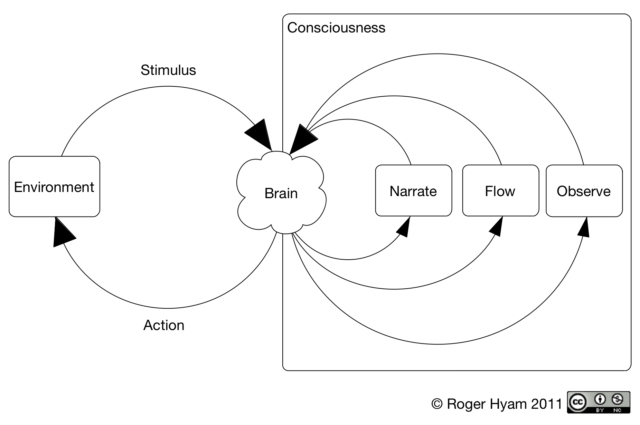

This is a followup post discussing how Mindfulness Based Cognitive Therapy might map on to [A Model of Mindfulness](http://www.hyam.net/blog/archives/1141) and should be read in conjunction with that post.

The modes of mind presented in [A Model of Mindfulness](/blog/archives/1141) were inspired by the model of mindfulness in depressive relapse proposed by (Segal, Williams, & Teasdale, 2002). The models are similar but there are some significant differences. In MBCT two modes of mind are recognised “Doing” mode and “Being” mode and the analogy of changing gear in a car is used for moving between these two modes. We can only be in one gear at a time.

Doing Mode is very similar to the narrate mode proposed here in that it is involved in maintaining a story of how the world is, how it should be and what should or ought to happen to make it that way. Depressive illness is caused by inappropriate cycles of rumination in doing mode. But doing mode, as described by (Segal et al., 2002, p. 70) differs from narrate mode in that it includes the subconscious 'automatic pilot' aspects of behaviour (page 99).<!--more-->

We may feel anxious and eat another cookie without it even entering our conscious thought. According to the model proposed here the cookie is not eaten in narrate mode. Only in retrospect will we create a narrative about the action. By contrast, in the MBCT model, the cookie is eaten in the un-mindful doing mode. This is an important distinction. We can only work with what we are conscious of, the narrative not the action, and so a model must have a construct that differentiates between the two. If the long term goal is to cut back on emotional eating we have to make deeper changes in the mind that will prevent the action occurring before we are aware of it. In this both models are in agreement.

MBCT being mode appears to include both the modes of flow and observe. For example “being mode is characterised by direct, immediate, intimate experience of the present moment” (Segal et al., 2002, p. 73) would well describe a skilled musician performing a piece where there is no meta-consciousness present. They are neither ruminating over how well the performance is going nor are they the passively observing it. In one sense they are “descentered” from their thoughts but they are not in a meditative state. They are in flow. On the other hand the core skill of MBCT “involves moving from a focus on content to a focus on process, away from the cognitive therapy's emphasis on changing the content of negative thinking, toward attending to the way all experience is processed” (Segal et al., 2002, p. 75) which is nearer observe mode.

Decentering is therefore not entirely synonymous with observe mode as it is defined in terms of leaving the cycle of ruminative thought rather than being purely about observation. It is possible to be conscious of ones actions, not in discursive thought and also not in a state of meta-conscious awareness.

MBCT being mode also includes both concentration and insight (the samatha and vipassana of the Buddhist tradition) with an emphasis on the concentration (Crane, 2008, p. 46).

Conflating these different concepts into a single mode of mind may be useful when the primary goal is to move participants away from ruminatively narrating their lives.  There are  dangers however. These sub-modes may have very different therapeutic effects and one would design courses differently if one were favoured over another.

## References

**Crane, R. (2008).** Mindfulness-based Cognitive Therapy (1st ed.). Routledge.

**Segal, Z. V., Williams, J. M. G., & Teasdale, J. D. (2002).** Mindfulness-based Cognitive Therapy for Depression: A New Approach to Preventing Relapse (1st ed.). Guilford Press.
