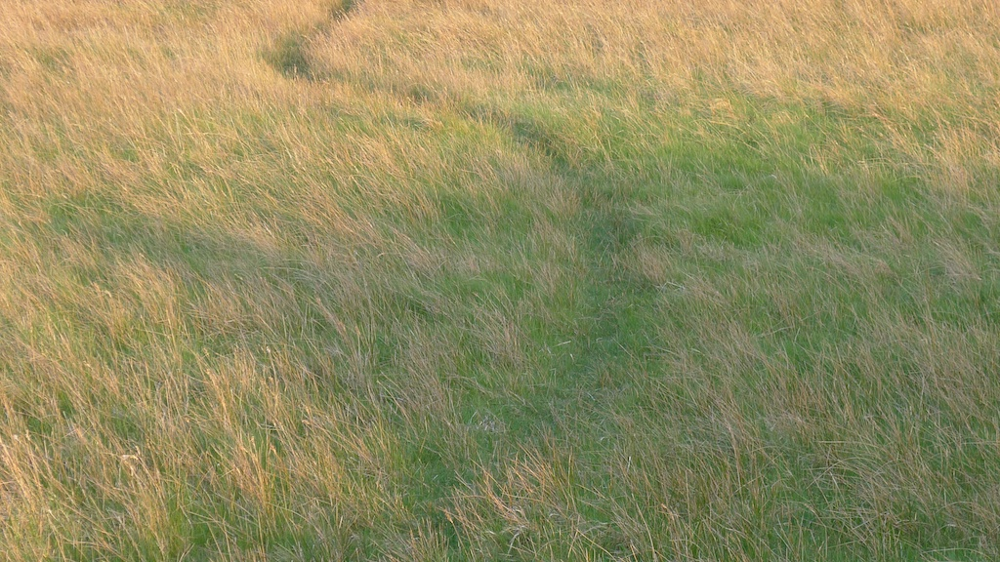

A friend just introduced me to [BuddhistGeek](http://www.buddhistgeeks.com) which looks like a wonderful source. I enjoyed listening to this podcast on [The Practice of Contemplative Photography](http://www.buddhistgeeks.com/2011/04/bg-214-the-practice-of-contemplative-photography/) - which I would highly recommend. It certainly chimes with how I have felt about my own photography.
