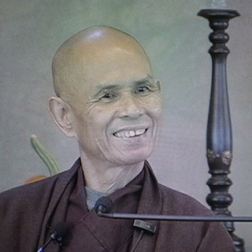

On reflection one of the reasons I enrolled in the [Bangor Mindfulness](http://www.bangor.ac.uk/mindfulness/) course was that I felt a need for some kind of accreditation before I could teach. In fact, if I want to teach in the public sector, I probably do need such an accreditation. We are as well to admit the world contains charlatans, fakes, hypocrites and quacks even if we don't actually point the finger at anyone.  I wouldn't expect my doctor to refer me to someone who hasn't been checked out or my kids to be taught by a fraud so I have to admit that - if public money is to be spent on teaching people mindfulness - the trainers will need to have some kind of kite mark or branding.

As the Bangor course has progressed I have come to the realisation that, if I were to teach mindfulness, I would not teach it in quite the way the standard eight week courses are delivered. If I were a professional I would take that in my stride. I would be able to adapt to the available terrain, work through the course, get qualified and then teach in my way. I am sure that this approach would be perfectly acceptable and I am sure it is what many people will do. But I am not a professional in this particular field so I really can't bring myself to invest the energy, time and money in working through the teaching modules  and assignments to show I could do what I wouldn't do.<!--more-->

I have learnt a lot. I have been left with questions around my motivation and around how society works. There is a big role to be played by things that aren't measured or quality controlled. I am inspired by the [Goenka Vipassana movement](http://www.dhamma.org/) and their policy of never charging but only accepting donations from those who have attended a course. They illustrate the core message of trusting your own experience.

The thing with charlatans and hypocrites is that we often see them in the mirror. We are often the ones doing the kidding and pulling the wool over our own eyes. Meditative practice is about realising this and seeing through to a deeper honesty.

Then I was watching a video of Thich Nhat Hahn (Thây)  doing a question and answer session back in 2005 at Deer Park Monastery in the USA. He was talking about increasing the number of retreats in the States and that he was getting old and wouldn't be able to come and lead them so he wanted people who were already practicing to come and help. What he said seemed very relevant to what I was thinking and so I have transcribed his words here - with slight amendments to make the English flow on the page.

> If you know how to enjoy mindful breathing \[and\] mindful walking you are already qualified as an assistant teacher because we need people with solid practice and we want to make the teaching and practice available to every year and to everyone ...
> 
> If you find yourself capable of enjoying your in-breath and out-breath, capable of making peaceful happy steps, you are already a good continuation of mine. If you know that you have eyes capable of seeing the beauty of nature around you and inside of you \[these are\] Buddha's eyes. These eyes are available to you. \[If\] you have lungs that are capable of breathing in and out mindfully and you enjoy your in-breath and out-breath \[these are\] the lungs of the Buddha transmitted to you by Thây. And \[if\] you have feet that are capable of walking in the pure land of the Buddha and the kingdom of God \[they\] are the Buddha's feet transmitted to you by Thây and **you are qualified \[and\] capable of sharing the Dharma, the living Dharma, to many people in the world.**

That about sums it up for me at the moment. I need to look to my own practice. One is as qualified as the joy one can find in breathing, walking and being. The rest will follow...

\[Note: There appears to be an alien looking over Thây's right shoulder. This guy really has a big following!\]
