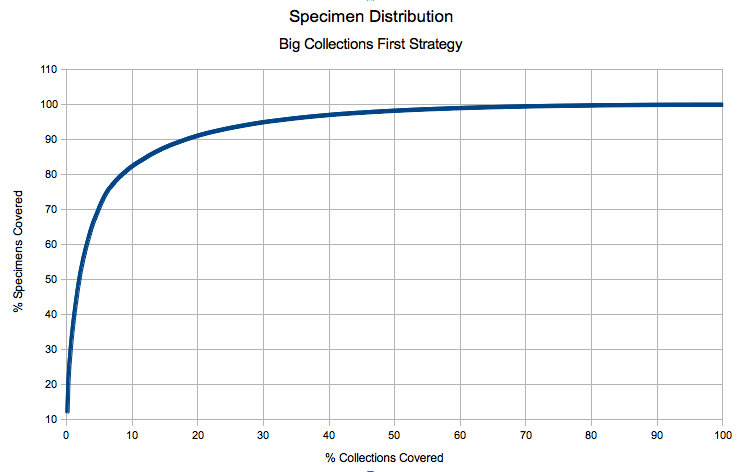

I've been slow to blog on my day job recently. Sometimes the dead ends are so embarrassing they are better not shared.

One thing worth sharing is a report I did for [Synthesys](http://www.synthesys.info/) on improving the quality of metadata on Eurorpean biodiversity collections. It includes analysis of the data in the [Biodiversity Collections Index](http://www.biodiversitycollectionsindex.org) and other sources and comes to some conclusions about how we could increase our knowledge of specimens held within Europe.

In summary - the majority of specimens are in a few large collections. If we improved the coverage of a few dozen major collections then we could cover the majority of specimens held. This is important because the ecomomies of scale kick in with larger collections. One techie guy can support the digitisation of a collection containing many millions of specimens almost as easily as a collection with only a couple of hundred thousand. This is not saying smaller collections aren't important it is merely a numbers game.

You can read a PDF of the full report but please remember this isn't a scientific paper it is a quick look at the data to think about what to do next. [NA3 Task 2.3 - Metadata on European Collections – Report and Forward Plan](report_02.pdf) - PDF
