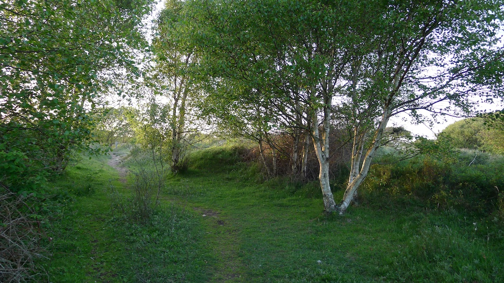

[Cognitive dissonance](http://en.wikipedia.org/wiki/Cognitive_dissonance) is a wonderful thing. At least it is a wonderful thing once you know about it and can enjoy the way it wags your opions and actions around against your will. It is amazing what we can't see because it is simply too unpleasant to contemplate. Of course the fun part is spotting it in other people. They suffer from dissonance whereas we allow for it!

One concept we use in the "mindfulness community" is  the difference between _Being_ and _Doing_. We urge people to stop _Doing_ stuff or even trying to do stuff and to start just _Being_. Segal _et al_ describe this as two modes of mind in "[Mindfulness-Based Cognitive Ther](http://www.amazon.co.uk/Mindfulness-based-Cognitive-Therapy-Depression-Preventing)[apy for Depression](http://www.amazon.co.uk/Mindfulness-based-Cognitive-Therapy-Depression-Preventing)" and use the evocative metaphor of changing gears in a car to describe how we shift between the modes.

This way of teaching mindfulness is incredibly useful.  I will continue to use it to explain mindfulness meditation - but it can be over done and it has just occurred to me how to explain what I mean by this.<!--more-->

The self is very sticky. We will do whatever we can to prop it up and our modern market orientated society plays on this. Think of an activity and someone will sell you something to wear to do it. We can't just go for a walk in the country, we have to have the right gear - country casuals. Going to the gym? New outfit. Going to do Yoga? New outfit and a nifty bag to carry your mat. Just sitting in front of the telly? Unisex slouch pants!

Then there is the use of the word 'like' as in: "I was like walking down the street and she was like just standing there giving me this like look like she really hated me and I was like really mad". The language may drive those of us over forty crazy but it is indicative of the way we all narrate our lives inside. Always in relation to ourselves in a particular role. I wasn't actually walking down the street I was playing the part of someone walking down the street.

We live in a world where playing the part is a big part of what we do and this is a big barrier to engaging with what is actually going on. We don't just walk down the street we walk down the street in style, wearing "walking shoes".

Now recall the last time you were on retreat or participating in a day of mindfulness. How did people move? Especially during the breaks. Did they look like they were walking on the moon? Perhaps they moved like they had soggy knickers or were as high as a kite. Did they move **normally**? Thinking back I now realise that I used to move like this and now I am sure I see other people doing it. Maybe you do.

It is very easy to shift from _Doing_ to _Being_ and straight on to _Doing-Being_ perhaps only just touching on _Being_ on the way past. We get it into our heads that being present, being mindfully aware of our current experience, is some mystical state and so we start trying to _do_ that. We think that being mindful must involve moving in a certain way, a certain tone of voice, a facial expression and perhaps even wearing certain clothes. We start to try to embody some imagined qualities. The self has crept in under the covers and is proudly proclaiming "Here **I** am on retreat being mindful" or for those under forty "I'm like actually hear like on retreat and I am being like really mindful".

In fact there is nothing special about mindfulness. By definition it is the most natural, normal state. How do we explain it to people when our culture says that what you are is everything, be that a rock star, athlete, father, accountant or student. We need not only to stop _Doing_ but also to stop _Being_ anything in particular.

I think the answer is to keep tabs on the mystical. Mindfulness maybe ineffable - beyond words - but that doesn't make it mysterious. It is just this, as it is now, at this moment.
