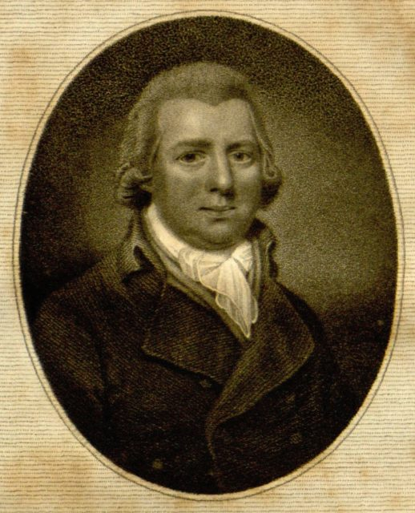
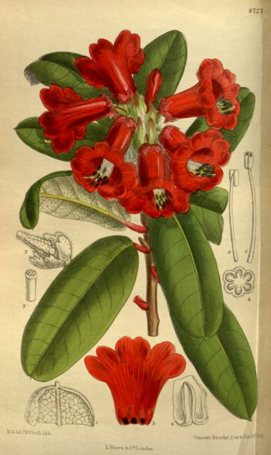

\[caption id="attachment\_1343" align="alignleft" width="298"\] William Curtis (1746-1799)\[/caption\]

This is a sideline to my working on the Edinburgh Rhododendron monographs.

The monographs often quote references to illustrations (icons) of species. This is useful as we know that these are illustrations that have been determined by the author of the account and are therefore "correctly" determined. What a shame we only have an abbreviated text string that can really only be understood by a human. An example might be "Rhododendron & Camellia Yearbook 25: f.58 (1970)". Because these are in the botanical monographic style it is near impossible even to turn them into an [OpenURL](http://en.wikipedia.org/wiki/OpenURL) that a resolver could make sense of - so we have a bit of a challenge.

For the just-under-four-hundred species accounts I have extracted from the first two monographs I have 445 icon strings. Of these 144 contain 'Bot. Mag.' - for [Curtis' Botanical Magazine](http://en.wikipedia.org/wiki/Curtis's_Botanical_Magazine) and so they look like a good set to try and parse and link up. The [Biodiversity Heritage Libary](http://www.biodiversitylibrary.org/) have digitized that proportion of [Bot. Mag. prior to 1920](http://www.biodiversitylibrary.org/item/91677#page/1/mode/2up) that is out of copyright thanks to [Missouri Botanic Gardens](http://www.mobot.org/). I just need to join it all up. In fact I could download the relevant images and embed them in my data because they are out of copyright.

So a happy afternoon was spent learning about the BHL API and writing XSLT and regular expressions to parse the strings I had. The result was a match up of just 59 illustrations. About the same number I could have done manually in an afternoon! The rest of my Bot. Mag. references are post 1920 and so locked up in copyright.

But a happy by-product of the process was the fact that I downloaded and parsed all the metadata for Bot. Mag. in BHL and extracted the item IDs (books) and page IDs for what I believe are all the illustrations - a total of 8,215. So if you are faced with the same issue as me you don't have to go to the bother of doing it. Here is a CSV file of the full list.

[All Curtis Illustrations In BHL (CSV)](http://www.hyam.net/blog/wp-content/uploads/2011/08/all_curtis.csv)

I have included the URLs to the resources in BHL although these are just trivial concatenations of the page IDs or item IDs and an http prefix.<!--more-->

\[caption id="attachment\_1346" align="alignright" width="248"\] Rhododendron neriiflorum\[/caption\]

Unfortunately the names of the taxa are not included as I was solving the problem of getting from a citation to an image - I already had the name. It would be tempting to try and calculate the names for each of the illustrations but I can't justify doing this right now so it is an exercise left to the reader.  The problem is the illustration in Curtis may come before or after the text on the species although on the plus side there is only one species per page. What I would try doing is:

- Calling for the OCR of the BHL pages **ids** immediately before and after the page id of the illustration
- See if the first few lines contain the page **number** (plate or tab. number) of the illustration.
- If they do then we have found the page for the plate so use Taxon Finder to extract the names of that page (there may be a BHL API call for this)

I am still left with 85 Bot. Mag. references I can't link to anything because Bot. Mag. is safely locked away [behind copyright at Kew and Blackwell Publishing](http://www.kew.org/about-kew/kew-publishing/journals/curtis-botanical/index.htm). Wouldn't it be nice if they created a web page for every illustration that contained at least a low resolution version.

I hope the attached file is of some use to someone and also that no one points out I could have done this more quickly and easily by some other route. If you use it please post a comment - thanks.
