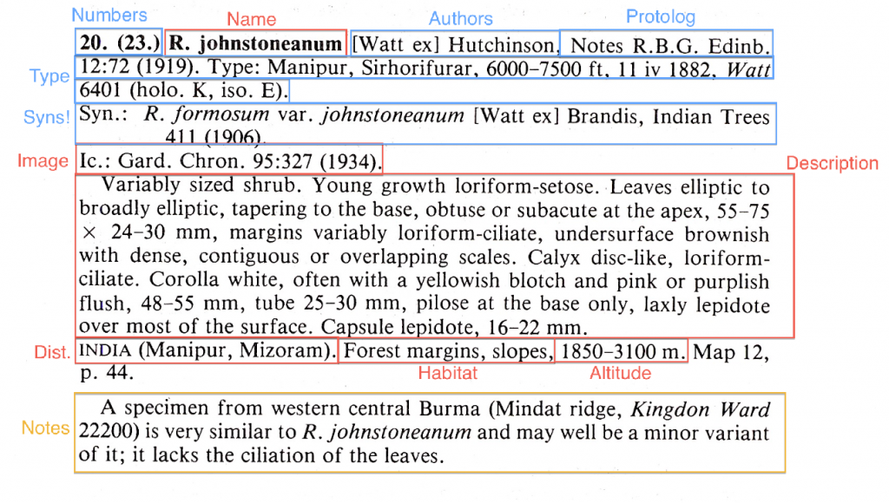

This post deals with the semantics of extraction of data from the _Rhododendron_ monographs. Another post will deal with the technicalities of the actual extraction.

The image above shows a species description entry. It was chosen as being a small and simple example for illustrative purposes. I have marked up the bits I am interested in extracting. Red indicates important fields, blue unimportant and yellow something in between - but why those bits and those priorities? Monographs contain a great deal of other stuff such as keys and descriptions of higher taxa and discussions. We could argue for hours about what should be extracted and never come to a conclusion unless we have some guiding principles on what we are trying to do. I have therefore developed five guiding principles for the project that are probably pretty general and may be applicable to other such projects:<!--more-->

1. **We are extracting data NOT trying to create a digital facsimile of the document.** We already have the document in its physical form, as page images, as OCR'd text and as a PDF combining the two. We can read the document whenever we need to and it is highly unlikely we will want to edit it like a word processor file. We don't therefore need to capture anything that is to do with document layout such as fonts, line breaks, paragraphs and section orders.
2. **We are NOT trying to extract ALL the data in one pass.** The process is not destructive and we can always return at a later date. We will probably be better at interpreting the document in the future and we may have a different perspective on how to interpret it. We should only pull out what we need today not what we think we might need at some point in the future - but see point 5.
3. **Use-case driven.** We should have some use-case (or story) about how the data will be used. This is the basis on which we can make all the smaller decisions.
4. **Opportunistic.** If it really is free then we will have it! Points 2 & 3 should not prevent us from capturing data that comes for free as a by-product of the process. We should be careful we are not kidding ourselves though and drop anything that is taking time but contribute to the use-case.
5. **Provenance should only be to a useful point in the document.** It is easy to get carried away with capturing provenance metadata about where in the document a piece of information comes from and what has happened to it since then. In the example above we could capture the fact that _R. johnstoneanum_ occurs in **India** is defined by the first word on the fifth paragraph of the species account rather than having been extracted from a map or the type locality but before we know it we are effectively recreating the document (point 1). Instead we merely tag data with the species account (document section) the information comes from and the page on which the account occurs. If someone wants to track down where a fact came from they can be taken to the relevant section of the document and read it for themselves.

If these are general principles what's the use-case for this project, what do we actually want to do today?

1. Create species page data for Encyclopedia of Life.
2. Data should be of biological interest - about a species of organism not about the processes of taxonomy and nomenclature. It is taken as read that the nomenclature has been sorted out by the experts and we are just dealing with the products of that process.
3. We are only interested in 'species' - or basic units of diversity - and so not in capturing higher levels of taxonomy such as groups, subsections, sections and subgenera.
4. We are interested in tagging the species with facts that can be extracted e.g. occurs in India; Habit Shrub; Habit Tree; etc - these are largely opportunistic.

The result is to extract the following fields of data for each species account

- **altitude-around** = When the description contains a single altitude value in meters, often with a circa
- **altitude-max** = The max altitude in meters
- **altitude-min** = The minimum altitude in meters
- **description** = The bulk of the descriptive text - possibly for further data extraction later
- **distribution** = A fairly uniform string describing the country and province distribution
- **habitat** = The habitat string - this is very variable
- **name** = The actual name expanded to include _Rhododendron_ rather than R. but without the author string
- **name-author** = The author string
- **name-cite** = The protolog (original place of publication of the name)
- **name-type** = A description of where the type is located
- **note** = Most species have one or two paragraphs of notes
- **volume-part-page** = A pointer to the page the species account starts on
- **icon-ref** \= A reference to a image of the specimen
- **synonyms** = All the synonymy as a single block of text

I'll talk about the mechanism of doing the extraction in another post.
