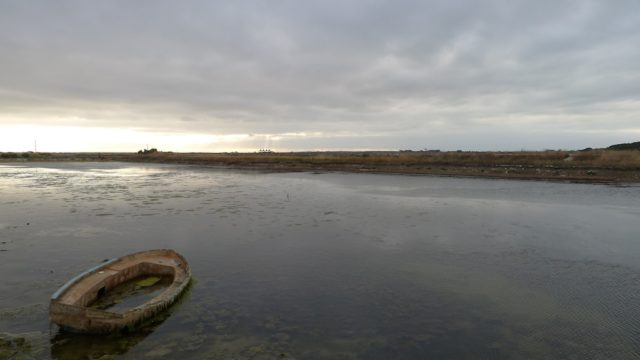

Find attached my fourth and final assignment for the Bangor Mindfulness course. This one is for the Research module. It is supposed to be a description of a research project that you intend to do later in the course in a form close to what would be suitable for submission to the ethics panel.

- [Research\_Assign\_Two\_blog\_version.pdf](Research_Assign_Two_blog_version.pdf)

The proposal makes reference to a prototype application I developed that you can access at  [http://breathfollower.appspot.com/](<http://breathfollower.appspot.com/ >) if you would like to try it for yourself. I have done some work to take this further as a mobile application and will blog on it if I get it to a state worthy of release.

By the time I was writing this up I had decided I wouldn't proceed with the course so it was a kind of fantasy proposal rather than a serious one. I did a ten minute presentation on it and the tutors pointed out that they didn't think it would produce an effect in the two week duration of the experiment but I did nothing to change this and the marked me down accordingly. I got  69% which is just 1% short of an 'A' - always the bridesmaid never the bride I guess :) I hope you enjoy reading the assignment.

I'll put another post together in the next few day summarising my reasons for leaving the Bangor course.
