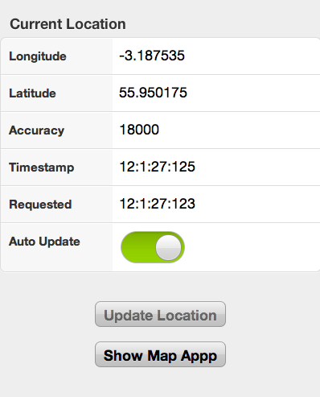

I have long been excited about HTML5 having access to a geolocation data. It should make it possible to build a whole range of applications for phones and other devices that are cross platform but make use of the users location. Unfortunately reality bites when you try and actually build an application based on the technology.

I have been working with [Sencha Touch](http://www.sencha.com/products/touch/) and the Ext.util.Geolocation object but am having problems with accuracy. I have noted the following behaviour.

When I call for a location on iPhone (3G) and iPad (v1) I get a one with around 1.3km accuracy. Basically it places me at one of two spots about 1km apart. If I switch to the native maps app then it places my position within 10m of where I am standing - that "wow it knows where I am" accuracy . Switch back to my web app and the first call to the GeoLocation returns similar accuracy. Any subsequent calls return the old inaccurate positions.<!--more-->

I have tested this briefly on Android (Google's first phone) and have similar behaviour.

I am setting allowHighAccuracy=true and I have experimented with different age and time out durations to no effect. I have also tried calling the underlying JavaScript methods with similar results so I don't believe it is the Touch libraries - but would welcome your thoughts.

My conclusion is that both iOS and Android only pass cell tower level location accuracy to the browser and do not ever use GPS - at least not in an urban environment. Basically enableHighAccuracy from the [Geolocation API spec](http://www.w3.org/TR/geolocation-API/) is ignored. Is this a correct assumption? I hope it isn't because it effectively cripples the HTML5+GPS application market.

I wrote [a test application](http://www.hyam.net/geotest/) that you can use to check this behaviour for yourself. Remember this is a mobile app. You can test it in Chrome or Safari on the desk top but will need to load it on your phone and be **outside** to benefit from GPS! Dink the QR Code with your phone and take a stroll if you are reading this indoors.

The application allows you to either poll the location by tapping the "Update Location" button or ask the browser to continuously update your location using autoUpdate. The maximum age parameter is hardwired to zero so any requests should attempt to fetch new location data. The time out is set to 20 seconds. You will find that if you keep punching the "Update Location" button when it isn't returning new locations you will just get a series of time out alerts 20 seconds later.

Finally the "Show Map" button will launch the maps app on iOS devices and put a place marker on where HTML5 thinks you are. You can then compare it with where the maps app thinks you are. They are often different immediately or, after a few seconds, the maps app will move your current location to a far more accurate spot as the GPS kicks in. On Android the behaviour of the "Show Map" button is less obvious as it doesn't always appear to open the maps app and sometimes just opens the Google Maps application. You will have to open the maps app manually.

I find it amazing that there are so many posts out there raving about location info in the browser yet when I try and use it I find it actually sucks. Maybe OK for finding your nearest Starbucks but not a lot else. If you have read [_The Inmates Are Running the Asylum_](http://www.amazon.com/Inmates-Are-Running-Asylum-Products/dp/0672326140) by Alan Cooper then you will be familiar with the notion of "Dancing Bear Software" - it is amazing the bear can dance, what a shame it doesn't dance very well!

I do hope I am doing something really really dumb here and am totally wrong. Please look at the code in my app page and tell me so.
