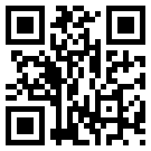

Last winter, whilst exploring ideas for a possible research proposal, I wrote a prototype desktop web application to help people learn the [Mindfulness of Breathing](http://en.wikipedia.org/wiki/Mindfulness_of_breathing). It formed the basis of an  assignment that you can read about in [a previous blog post](http://www.hyam.net/blog/archives/1410). The application, BreathFollower, is still running on  Google App Engine at [http://breathfollower.appspot.com/](http://breathfollower.appspot.com/) . Almost as soon as I started developing that application I began to regret not developing it for the mobile phone. BreathFollower won't even run on an iPad. I thought that if you could cradle the application in your hands, in a similar position to the cosmic mudra,  and tap the screen with your thumb to interact with it, it would be more effective. As soon as my assignments were out of the way I started on a phone based application.<!--more-->

After too many late evenings and weekends I am proud to announce the initial launch of MindfulnessTree. This is an HTML5 based application that will run on iPhone, iPod Touch, Android and some of the latest versions of Blackberry phones. It should be thought of as in [Beta](http://en.wikipedia.org/wiki/Beta_release#Beta) development but it should work OK and I believe it could have a useful role in helping people in their practice. I need feedback before I can take it any further.

Many people recoil at the idea of using information technology to teach mindfulness and I sympathize. MindfulnessTree is not a complete solution. It could be thought of as like a set of [Mala Beads](http://en.wikipedia.org/wiki/Buddhist_prayer_beads). It may be useful in the context of a broader practice or even as an introduction or key to get someone started. I have been using it as a way to anchor myself when taking breaks at work.

The proof of the pudding is in the eating. If you have an iPhone or Android based phone please go to [http://mt.hyam.net](http://mt.hyam.net) or use the QR Code to load the application and have a go. Let me know how you get on.
