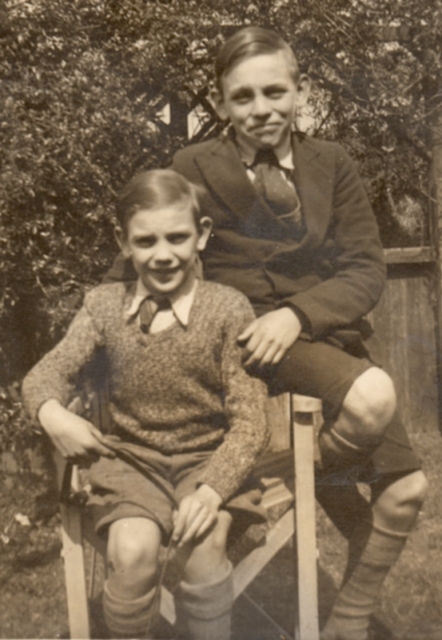
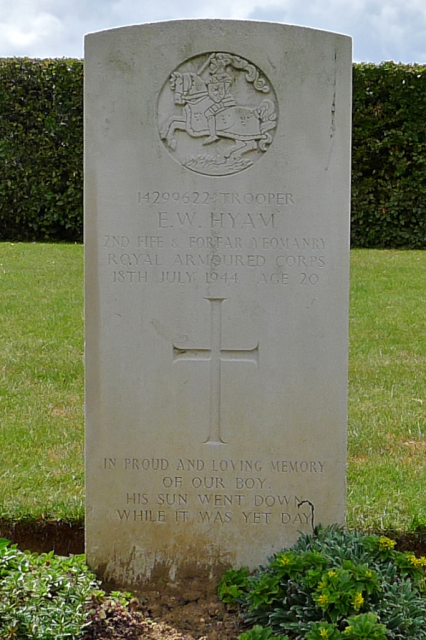
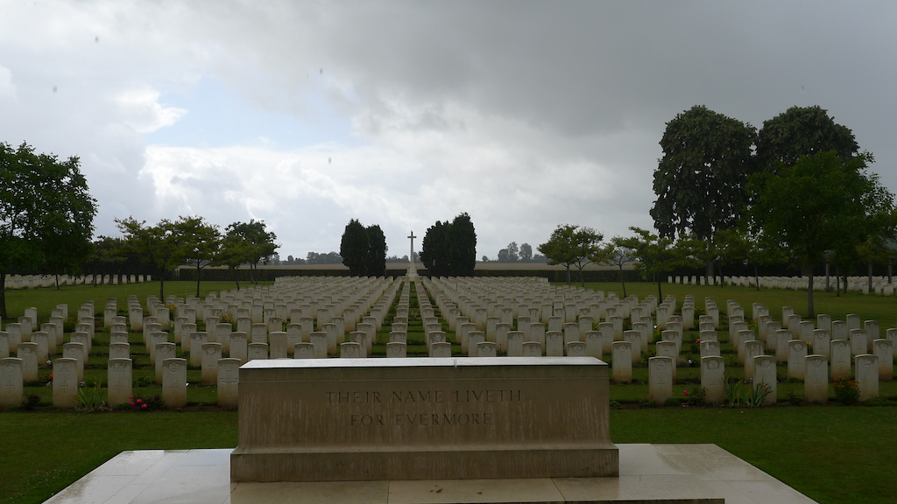

We took the camper van to France in the summer and, as we were passing, decided to visit the grave of my uncle Eric. I say my uncle but I feel uneasy calling him an uncle. He died a good twenty years before I was born and would have had no knowledge even of my potential future existence. To me he is a family story and something of an anchor point in history.

Eric was my father's older brother. Here is a picture of them together. It must have been taken about seven or eight years before Eric's death. He was killed in operation [Goodwood](http://en.wikipedia.org/wiki/Operation_Goodwood) to the East of [Caen](http://en.wikipedia.org/wiki/Caen) in Normandy in 1944. He was in a tank. He was 20 years old. I took a picture of his grave and of the graveyard in Normandy.

I have no recollection of my father ever mentioning Eric which says a great deal. My mother would talk about him. She didn't know him personally but said that his death had devastated my father's family.

My overriding thought on visiting his grave was that this is the only grave in the family. My grandparents and parents are all dead, cremated and gone with no monuments. They all lived vastly longer lives than Eric. It was an odd thought. In some way this one short life and lump of stone was anchoring all these other people.

I have tried to talk about this in the intervening six months but on several occasions received a somewhat disparaging "Oh that is very popular at the moment" kind of response. I believe that they are right. There is a great deal of interest in remembrance of the war dead at the moment. Perhaps this is the product of the long running conflicts in Iraq and Afghanistan - a [Royal Wootton Basset](http://www.woottonbassett.gov.uk/) effect. Maybe people are feeling that we are losing touch with the great European wars of the 20th century as that generation passes on. It may be just that the countless war documentaries produced to fill the endless hours of multichannel television have finally sunken home.

I find it all vaguely annoying because I want to talk about **Remembrance** as opposed to **Remembering** and Eric's story is a key into that for me. I can't remember someone I never met but his life and death still have great significance for me.

When Jesus beseeched his followers to "Do this in remembrance of me" at the last supper he didn't mean make a documentary about his life and make sure you remember all the facts. He meant something else. When people carved "Lest we forget" onto war memorials they weren't instructing future generations to literally remember all the names and dates of the people on the memorial. They meant something else. What they meant, of course, was that we should bring these things to mind. Think **of** them not just **about** them. This is why only silence will do. Words are about remembering. Silence is about remembrance.

For me this is integrally linked with my mindfulness meditation practice. Mindfulness comes from the ancient Indian word _sati_ which has strong connotations of remembrance. It is bringing the present to mind as one might bring the past to mind. Remembrance of those who have gone before is pausing to be present now. Being here for them and for us.

.
