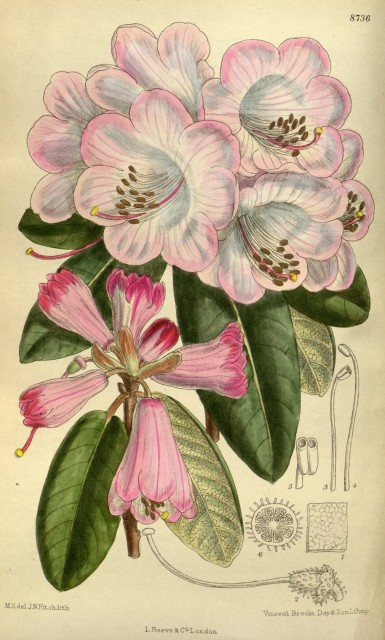

I've had my head down work wise for the past few weeks trying to get the _Rhododendron_ monograph markup finished. I now have a little database with some 821 species accounts in it plus a few hundred images - mainly of herbarium specimens. The workflow has been quiet simple but very time consuming.

1. Text is obtained from the source monograph either via OCR or access to the original word processor documents.
2. The text is topped-and-tailed to remove the introduction and any appendices and indexes.
3. Text is converted to UTF-8 if it isn't already.
4. An XML header and foot are put in place and any non-XML characters are escaped  - this actually came down to just replacing & with &amp;
5. The text is now in a well formed XML document.
6. A series of custom regular expression based replacements are carried out to put XML tags at the start of each of the recognizable 'fields' in the species accounts. These have to be find tuned to the document as the styles of the monographs are subtly different. Even the monographs published in the same journal had some differences. It is not possible to identify the start and end of each document element automatically. This is for three reasons:
    1. OCR errors mean the punctuation, some letters and line breaks are inconsistent.
    2. Original documents have typos in them. A classic is a period appearing inside or outside or inside and outside a closing parenthesis.
    3. There are no consistent markers in the source documents structure for some fields. For example the final sentence of the description may  contain a description of the habitat, frequency and altitude but the order and style may vary presumably to make the text more pleasant to read. The only way to resolve this is by human intervention.
7. The text is no longer in a well formed XML document!
8. The text is manually edited whilst consulting the published hard copy to insert missing XML tags and correct really obvious OCR errors. In some places actual editing of the text is needed to get it to fit a uniform document structure as in the habitat example above.
9. The text is now back to being a well formed XML document.
10. An XSL transformation is carried out on the XML to turn it into 'clean' species accounts and alter the structure slightly.
11. An XSL transformation is carried out to convert the clean species accounts into SQL insert statements for a simple MySQL database. The structure of this database is very like an RDF triple store (actually a quad store as there is a column for source). A canonical, simplified taxon name (without authority or rank) is used as the equivalent of the URI to identify each 'object' in the database. Putting the data in a database makes it much easier to clean up and to extract some additional data. An alternative would be to have a single large XML document and write XPath queries.<!--more-->

By writing queries that join the _Rhododendron_ database to institutional databases I can create lists of living and dead specimens at Royal Botanic Garden Edinburgh and extract images from the herbarium digitisation project. Previously I extracted images from BHL that I can also join in. I can do things like 'tag'  species with the ISO country codes, whether they are epiphytes, their altitude range - all interesting facts. I can imagine someone asking a real question such as "Give me accounts for all the rhododendrons that occur above X meters in Thailand".

I could write a bespoke front end to the database that enables this functionality but this wouldn't help someone answer the question "Give me accounts for all the XYZs that occur above X meters in Thailand". Let's face it only a small bunch of taxonomists and enthusiasts are interested in data that **only** includes rhododendrons. For most people this data will  never be the whole answer. I am being funded to do this work so that we can get the information from the Edinburgh _Rhododendron_ monographs into the Encyclopedia of Life. There it can be mixed in with data from many other sources and so move towards answering the questions "most people" are likely to ask.

**'Properties' I Have Captured**

From the workflow described above you can see that the  properties I have in my database **have** to represent the document structure of the monographs - plus some tags extracted by very simple data mining.  The properties are:

- **altitude (around, max, min, range)** - Many accounts include a range of numbers or maybe a single 'circa' number.
- **description** - Diagnostic description. Importantly this may or may not include characters that have been mentioned higher up the taxonomy in a group, subsection, section or subgenus description.
- **distribution** - Usually the country and province. Sometimes individual mountains or parks.
- **habitat** - a sentence describing the habitat but often including whether it is epiphytic or terrestrial (shouldn't this be habit?) and also whether it is common or not.
- **icon-ref** - a citation of where an image can be found in the literature.
- **image** - a link to a Curtis image.
- **name (author, cite, formatted)** - Three properties breaking down the name
- **type -** The type citation string for the accepted name of the taxon.
- **note** - All sorts of things in here! Almost all accounts have some comment varying from "Known only from type collection" to several paragraphs of text. May include derivation of name. May occur multiple times  for a species.
- **occursInCountryIso** - this was extracted by simply looking for country names in the distribution field
- **rank -** the database contains facts about the subspecies, varieties and even forma that occur in the monographs (see below)
- **subgenus** - a single word indicating which subgenus the species is in. Subgenera in Rhododendron could be thought of as genera ...
- **synonyms** - this is a block of text representing all the names, types and citations that came in the synonyms paragraph.

To get these properties into EoL I need to squeeze them into the [EoL Transfer Schema](http://eol.org/info/create_xml) . (Here I need to have a declaration of interest in that I think I was in on the original design of this at a workshop at GBIF as few years ago.) The basic structure is like this:

- Document
    - Taxon
        - Name
        - Source
        - Other Metadata...
        - DataObject
            - Type
            - Source
            - Other metadata...
            - Value
        - DataObject
            - ..
    - Taxon
        - ...

So a document contains a number of taxa and each taxon contains some metadata plus a number of DataObjects. Each DataObject is of a 'type' and has its own metadata plus a value of some kind - such as text or a link to an object. This is a very generic data structure that allows for expansion by adding new types of DataObject.

All I need to do is hack together a PHP script to map my properties to the DataObject types and I can go back to trying to clean up the data. This is what the types look like:

> Associations, Behaviour, Biology, Conservation, ConservationStatus, Cyclicity, Cytology, Description, DiagnosticDescription, Diseases, Dispersal, Distribution, Ecology, Evolution, GeneralDescription, Genetics, Growth, Habitat, Key, Legislation, LifeCycle, LifeExpectancy, LookAlikes, Management, Migration, MolecularBiology, Morphology, Physiology, PopulationBiology, Procedures, Reproduction, RiskStatement, Size, TaxonBiology, Threats, Trends, TrophicStrategy, Uses

These map to subject types on taxon pages within EoL. There is a description of these [on the EoL help pages](http://eol.org/info/toc_subjects).

This is where I run into a problem. My properties don't map to these subject types. The only matches I really have are Distribution, Description and Habitat. The advice is to put "note" type data under "Description" so probably 90% of what I have goes into "Description" DataObjects. Why have I just spent the last umpteen weeks marking all this stuff up?

There are interesting and important questions here:

- How important is semantic mark up of this kind of data? What advantages are gained over just treating each species treatment as a single block of text? I could still pull out all the ones that occur in China etc.
- If the EoL Subject Types are a list of the kinds of information people want to see on species pages and they don't match the data that is captured in a monograph should we continue to produce monographs in their current form? Who is driving the production of data, the users or tradition?
