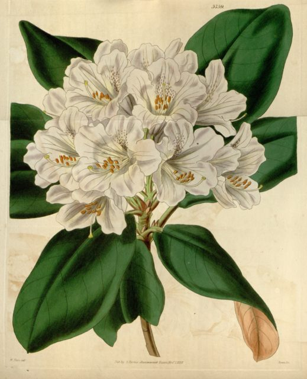

Whilst I have been working on digitizing the _Rhododendron_ monographs I have also been providing some technical help for Stuart Lindsay who is producing a series of fact sheets for the Ferns of Thailand. This has helped crystallize my thoughts regarding monographs and how we migrate them into the digital age.

This post is a follow on from a previous one where I discuss mapping the [Rhododendron monographs to EoL](http://www.hyam.net/blog/archives/1498). It is an opinionated rant but I offer it in the hope that it will be of some use.

When monographs/floras/faunas are mentioned in the context of digitization people usually chirp up with PDF or, if they are more clued up on biodiversity informatics,  [TaXMLit and INOTAXA](http://www.inotaxa.org/) (Hi to Anna if you are reading) or [TaxonX and Plazi.org](http://www.plasi.org) (Hi to Donat).  The point I am going to make in this blog post is not against these ways of marking up taxonomic literature but more the nature of the monographic/floristic/faunistic taxonomic product itself. I am far more familiar with the botanical side of things so apologies to zoologists in advance.<!--more-->

The problem is what I call the "narrative form" of monographic data not whether it is available in print, pdf, ebook or lovingly marked up XML. These publications are arranged hierarchically. There is introductory material, family descriptions, generic descriptions, species descriptions, subspecies descriptions. These descriptions are nested within each other and it isn't always clear what information in one level of the hierarchy is repeated at lower levels. Descriptions are diagnostic within the frame of reference of that treatment i.e. they provided enough detail to separate that taxon from the others at that level in that particular hierarchy. Differentiating the taxon from other taxa in other treatments of the same or overlapping groups is usually relegated to notes.

Today we talk of monographs having this form because they reflect phylogeny. Previously they reflected a more ill-defined 'affinity' or natural ordering. Originally hierarchies were used as an _aide-mémoire_. This results in a mishmash of  concepts that it is difficult to decode. Phylogenies do not have ranks or a linear order yet monographs do. So what does the order and rank in a phylogenetically based monograph represent? If these things exist as _aide-mémoire_ then why aren't they totally arbitrary - merely picking out the most easy to remember characteristics of different groups and making no attempt to represent evolutionary history.

Imagine approaching a monograph/flora/fauna with a species name. You look it up in the index. Turn to the right page and then have to assemble a description of the taxon by reading back up the taxonomic hierarchy - unless of course the author has redundantly repeated all the descriptive data in the species level account which begs the question of what the higher level accounts are for.

Now suppose you have in your hand an unknown specimen. First thing you need to do is to know the family and possibly the genus so you can find the right work to look it up in. There is rarely a multi access approach to getting you near to a taxon such as "deciduous trees with palmate leaves". You have to be a taxonomist, have fertile material and more or less know what the thing is before you even start. By definition the monographs are not optimized for identification of specimens.

This means that these works are mainly of use to taxonomists who are familiar with the groups concerned. But what do they use them for?

If a taxonomist is working on a new revision they won't be consulting current, extant monographs very much. That work has been done and shouldn't need revising for decades. They will be working on material that hasn't been monographed for decades if ever and needs to be classified. If they are finding new species within a recently monographed group then they will be turning over the apple cart because the descriptions in that monograph are now out of date because the monographic form is designed to be comprehensive.

What is more likely is that a taxonomist will use existing monographs to produce secondary taxonomic products such as field guides - and this is where my key point comes in.

## **Remixing**

Suppose you want to produce a secondary taxonomic product. Say a guide to the lowland trees of a country. Even if you had a checklist of all the species of the country how would you know which were lowland trees? That kind of habit character is likely to be buried in descriptions. Even if you had your list of the species how would you build your guide? How would you pull together free standing descriptions of each taxon? The only way at the moment is to roll your sleeves up an become a taxonomist. Start writing new descriptions based on the contents of monographs (in which the descriptions are designed to differentiate your target taxa from taxa that will not be included in your guide). This kind of thing should really be done automatically. We should be able to do a search for all the species that are considered trees and occur below a certain altitude and find free standing descriptions of these species that we can load on our phone or tablet or print in a booklet and take into the field. The stuff that taxonomists currently produce does not support this kind of behaviour.

What about putting the monograph on the web? If someone links to a species what do we show on the page that is displayed? Do we include the genus description as well? What if the species description doesn't mention the generic characteristics? Do we include the subspecific taxa? What if the subspecific taxon is only defined in terms of its minor differences to the main species - "var. alba"

Two years ago I discussed how difficult it is was to handle hierarchies in [Synonyms Are SubClasses And Higher Taxa Are Just Tags](http://www.hyam.net/blog/archives/707) which is a little more technical than this piece but makes similar points.

## **Tough Love**

Producing electronic versions of narrative monographic works is OK  from a political point of view and, if you are doing a print copy you may as well do an ebook and pdf but from the point of view of a non-taxonomist it is of little value and we shouldn't kid ourselves that we are increasing accessibility very much. It may even be counter productive because people think they have produced an electronic resource when all they have produced is a facsimile of the paper one that is probably slower to use.

## **My Suggestion**

Taxonomy needs to move to a **One Species Per Publication** model - I call this a fact sheet based approach. Instead of producing monographs of groups taxonomists should produce single free standing publications, one per single species with a global scope. If their primary interest is in phylogeny then they produce separate papers that only discuss the relationships between species that are already described in the free standing publications. This approach is far more appropriate for this digital age for the following reasons:

- **Referable -** Single species can be used and referenced like other scientific or web resources. It is possible to refer to the use of a species in a study or in legislation and reference a single source that just describes that species. A lawyer can right a document that says we want to conserve species X as described in publication Y and that statement is not entailed with all the other taxa and data that is presented in publication Y.
- **Remixable -** It is possible to pull together a set of species descriptions to form a new resource. This may be done either automatically, say from a list of occurrence records for a region or habitat, or on a pick'n'mix basis (see taggable below).
- **Granular Versionability (= Stability) -** It is possible to replace individual species definitions in a set of definitions without having to reversion the whole lot. A new phylogeny or new species in a genus need not change other species in the genus that may be subjects of legal protection etc.
- **Data transparent -** In a typical monograph the data is of varying quality. One species may be based on five hundred specimens and another on only five. This isn't always clear from casual use of the monograph where specimens examined and data analysis are typically presented separately from the main treatment. If all the data used to define a species is presented in a single publication then things become a great deal clearer.
- **Granular Peer Review -** Not all monographs are peer reviewed. Those that are are taken all or nothing. Suppose a monograph of twenty species is presented. It may be very good and have a good phylogenetic analysis etc. Perhaps two of the species are not particularly well defined but it is of high enough merit as a whole to be published. The result is that 10% of species are not particularly well defined! It would have been better to pass eighteen species and reject two. Taxonomy is riddled with such species. You only need to read a monograph that is sinking ill-defined species from the previous monograph that probably shouldn't have been published in the first place - whilst creating new ill-defined species of its own.
- **Taggable -** Anything that can be reliably referenced can be tagged. This means that it becomes possible to build meaningful lists of species that can be pulled together into useable products. The tagging does not have to be done by the authors. For example IUCN tags species with conservation status and a group working on functional ecology may tag them with their functions in the environment. It is then possible to pull together a list (with descriptions) of endangered species that perform a certain role in the environment. Currently this process only leads to a list of names that can be handed off for someone to work on trying to establish what the different sources meant by those names.
- **Faster More Agile Development -** We can't describe all the species on earth in the way we have been doing with the resource available in a reasonable time. This is **not** an unusual problem. All domains are faced with challenges that can't be addressed by the resources available. In software engineering the 'agile' approach to this problem is to prioritize development of important, doable things to build an initial working system and then revisit and re-prioritize what needs doing next. Publish results quickly and often. In taxonomy the opposite approach is often taken. A group is selected for monograph and worked on until resources are exhausted and the monograph is then published. By adopting a One Species Per Publication approach the 'easy' species would be published as soon as the researcher was sure they were 'good' taxa making their work available for others to use and give feed back on years sooner than is traditionally the case and whilst resources are still available to respond. Should the project stall or fail to complete then possibly the most valuable results will already be in circulation and not lost to science. Those enormous genera that are a life times work for someone could be chipped away at by the army of short term employees who are replacing career scientists!
- **It would make the job of aggregators like EoL much, much easier!** If we accept the fact that we need projects like EoL (which I think we all do) then we must also accept that we need to produce data in a form that they can use.

## Summary

This is a long post so to summarize my proposal

1. Stop writing monographs or  floristic or faunistic regional accounts of taxonomic groups.
2. Produce individual, self contained fact sheets of single species that are global in scope.
3. Use 'Agile' development techniques to produce and update these rapidly.
4. Treat phylogenies as separate products that handle the arrangement of the entities described in fact sheets.

I am sure this will put a lot of peoples backs up. Please leave a comment if you agree and well as if you want to see my lynched.
