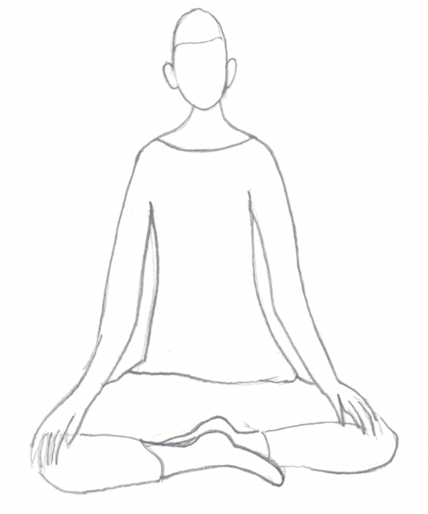

Today I launch the first version of my "_A Brief Introduction To Mindfulness Meditation_" pamphlet with a massive print run of fourteen! Plus availability on-line and the possibility of printing as many as needed of course.

**Download a digital copy to read and freely distribute from the [downloads page](http://www.hyam.net/pamphlet).**

Near the end of 2010 I became frustrated with what I thought of as the "barriers to entry" for people who were interested in developing a meditation practice. It was as if the very bottom rung of an otherwise excellent learning ladder was missing.<!--more-->

I had just embarked on the MSc course in mindfulness at Bangor University. Friends and relations would ask what it was all about. You can't explain this kind of thing in a social setting so I'd come away feeling frustrated having probably just confused them. Some of these people were genuinely interested but they weren't going to invest the time in reading a whole book or attending a course. They needed a lower bar. Something they could read over a cup of coffee or on a short train journey that might lead to something more.

New people would come to our sangha evenings with little or no experience of meditation and we had nothing to give them in their hand. We might spend a few minutes explaining our practice but this was largely taken up with the order of service for the evening rather than the fundamentals of meditation. I felt they may be leaving a little bemused by the whole thing.

In response to these stimuli I started writing a pamphlet. Although I love digital media and think it is the way everything is headed I believe what is needed here is a physical object that can be given as a gift. I was also inspired by the notion of becoming an old style Pamphleteer!

It has taken me over a year to complete the first version of a sixteen page A5 publication and I could carry on refining it forever. It has been a good practice to work up the text and then pass it around a few friends for their comments before reworking it. Accepting criticisms of the written word and filtering out what to include and what not is wonderful for exposing ones ego tendencies! Writing this has been quite a struggle but I hope it doesn't show in the text.

Please make use of the pamphlet and let me know what you think. If you would like a hard copy (with a coloured cover!) then drop me an email at the address in the pamphlet and I'll see what I can do.
